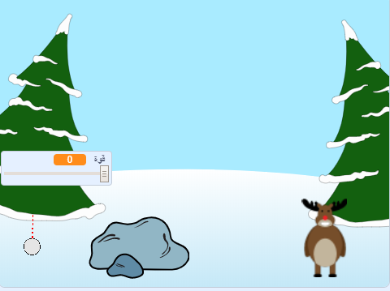

--- no-print ---

هذا هو إصدار **Scratch 3** من المشروع. هناك أيضًا [إصدار Scratch 2 للمشروع](https://projects.raspberrypi.org/ar-SA/projects/snowball-fight-scratch2).

--- /no-print ---

## المقدمة

في هذا المشروع سوف تصنع لعبة عليك فيها رمي كرات الثلج على هدف.

### ما الذي ستصنعه

--- no-print ---

استخدم مؤشر الفأرة لزاوية كرة الثلج واضغط على زر الماوس لاختيار قوة كرة الثلج.

  <iframe allowtransparency="true" width="485" height="402" src="https://scratch.mit.edu/projects/embed/399478598/?autostart=true" frameborder="0" scrolling="no"></iframe>
  

--- /no-print ---

--- print-only ---

--- /print-only ---

--- collapse ---
---
title: ما ستحتاج إليه
---

### الأجهزة

+ جهاز حاسب آلي يدعم تشغيل برنامج Scratch

### البرامج

+ برنامج Scratch 3 (سواء أكان [عبر الإنترنت](http://rpf.io/scratchon){:target="_blank"} أو [دون اتصال بالإنترنت](http://rpf.io/scratchoff){:target="_blank"})

### التنزيلات

برنامج البداية ستجدة [هنا ](http://rpf.io/p/ar-SA/snowball-fight-go){:target="_blank"}.

--- /collapse ---

--- collapse ---
---
title: ما الذي ستتعلمه
---

- كيفية تحريك الكائنات
- كيف تتفاعل مع نقرات الفأرة
- كيفية استخدام البث (ارسال رسالة لكائن ثاني)

--- /collapse ---

--- collapse ---
---
title: معلومات إضافية للمعلمين
---

--- no-print ---

إذا كنت بحاجة إلى طباعة هذا المشروع ، فالرجاء استخدام الإصدار [الملائم للطابعة](https://projects.raspberrypi.org/ar-SA/projects/snowball-fight/print){:target="_blank"}.

--- /no-print ---

يمكنك الحصول على [المشروع كاملاً من هنا](http://rpf.io/p/ar-SA/snowball-fight-get){:target="_blank"}.

--- /collapse ---
