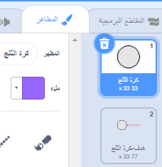
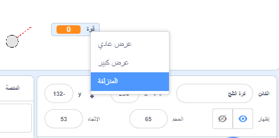
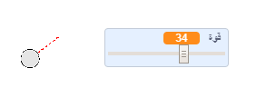

## صنع كرة ثلج

دعونا نصنع كرة ثلج، يمكنك رميها حول المنصة الخاص بك.

--- task ---

افتح مشروع Scratch للبدء.

**على الإنترنت**: افتح مشروع البدء [](http://rpf.io/snowball-fight-on){:target="_blank"}.

اذا كنت تملك حساب على منصة السكراتش (Scratch) فيمكنك عمل نسخة بالضغط على **Remix**.

**دون اتصال بالانترنت**: افتح [المشروع المبدئي](http://rpf.io/p/en/snowball-fight-go){:target="_blank"} عبر المحرر الموجود على جهازك.

اذا تحتاج تنزيل وتنصيب برنامج السكراتش Scratch على جهازك الشخصي، ستجده في [rpf.io/scratchoff](http://rpf.io/scratchoff){:target="_blank"}.

في بداية المشروع ، يجب ان أن ترى خلفية فارغة مع كائن كرة الثلج.

--- /task ---

--- task ---

كائن "كرة الثلج" يحتوي على مظهرين، مظهر عادي، ومظهر يظهر الاتجاه الذي تواجهه كرة الثلج.



--- /task ---

--- task ---

أولاً، دعونا نسمح للاعب بتغيير زاوية كرة الثلج. أضف هذه التعليمة البرمجية إلى كائن كرة الثلج الخاص بك:


```blocks3
when flag clicked
wait (0.5) seconds
go to x:(-200) y:(-130)
point in direction (90)
switch costume to (snowball-aim v)
repeat until <mouse down?>
    point towards (mouse-pointer v)
end
```

--- /task ---

--- task ---

اختبر مشروعك بالنقر على العلم الأخضر. يجب أن ترى أن كرة الثلج الخاصة بك تتبع اتجاه الفأرة، حتى تضغط على زر الفأرة.


--- /task ---

--- task ---

دعونا أيضا نسمح للاعب أن يقرر كيف يمكن رمي كرة الثلج بقوة. إنشاء متغير جديد يسمى `قوة`{:class="block3variables"}.

[[[generic-scratch3-add-variable]]]

--- /task ---

--- task ---

اسحب المتغير الجديد الخاص بك إلى أسفل المنصة، بالقرب من كرة الثلج. انقر بزر الماوس الأيمن على الشاشة المتغيرة على المسرح وانقر فوق "شريط التمرير".



--- /task ---

--- task ---

أضف تعليمة برمجية لتعيين متغير `قوة`{:class="block3variables"} الجديد إلى 0 عند النقر على العلم.


```blocks3
when flag clicked
+ set [power v] to (0)
```

--- /task ---

--- task ---

الآن بعد أن اصبح لديك متغير `قوة`{:class="block3variables"}، يمكنك زيادة قوة كرة الثلج _بعد _ اختيار الاتجاه مع هذه التعليمية البرمجية:


```blocks3
repeat until <mouse down?>
    point towards (mouse-pointer v)
end
+repeat until < not <mouse down?> >
    point towards (mouse-pointer v)
    change [power v] by (1)
    wait (0.1) seconds
end
```

هذه التعليمات البرمجية تعني أنه يجب عليك _ إبقاء زر الماوس منخفض _ بعد اختيار الاتجاه، لاختيار قوة كرة الثلج.

--- /task ---

--- task ---

اختبر كرة الثلج الخاصة بك، لمعرفة ما إذا كان يمكنك اختيار الزاوية والقوة الخاصة بها.



--- /task ---
