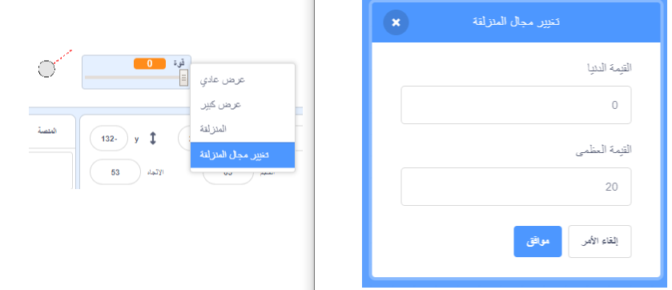

## الحركة الواقعية

لديكم الآن كرة ثلج، ولكن دعونا نجعلها تتحرك بشكل أكثر واقعية.

--- task ---

أولاً، دعونا نضع أقصى مستوى للطاقة، بحيث لا يمكن إلقاء كرة الثلج بصعوبة كبيرة.

في كرة الثلج الخاص بك `عند نقر العلم `{:class="block3events"} ، نحتاج إلى زيادة الطاقة فقط إذا كانت أقل من 20. تغيير تعليماتك البرمجية إلى:


```blocks3
repeat until< not <mouse down?> >
+   if < (power) < [20] > then
        change [power v] by (1)
        wait (0.1) seconds
    end
end
```

--- /task ---

--- task ---

اختبر كرة الثلج مرة أخرى، وسترى أن الطاقة لن ترتفع أبدا عن 20.

--- /task ---

--- task ---

الآن بعد أن بلغت القوة القصوى لكرة الثلج 20 ، يمكنك تعيين هذا كقيمة قصوى لشريط تمرير المتغير أيضا. انقر بالزر الأيمن على متغير الطاقة الخاص بك، وانقر فوق 'تعيين دقيق شريط التمرير والحد الأقصى'.




--- /task ---

--- task ---

يمكنك ايضا إبطاء كرة الثلج عن طريق تقليل الطاقة قليلا أثناء تحليقها عبر الهواء. أضف هذه الكتلة البرمجية إلى تعليمة كرة الثلج الخاص بك `عندما أتلقى [throw]`{:class="block3events"}:


```blocks3
when I receive [throw v]
switch costume to (snowball v)
repeat until < touching [edge v]? >
    move (power) steps
+   change [power v] by (-0.25)
end
hide
```

--- /task ---


--- task ---

اختبر هذه التعليمات البرمجية الجديدة - هل تعمل كما توقعت؟ قد تلاحظ أن القوة تنخفض وفي نهاية المطاف تتحرك كرة الثلج إلى الخلف!

لإصلاح هذا، يمكنك إضافة تعليمة برمجية`اذا`{:class="block3control"} إلى التعليمة البرمجية الخاص بك، بحيث يتم خفض الطاقة فقط إذا كانت أعلى من 0:


```blocks3
when I receive [throw v]
switch costume to (snowball v)
repeat until < touching [edge v]? >
    move (power) steps
+   if < (power) > (0) > then
        change [power v] by (-0.25)
    end
end
hide
```

--- /task ---

--- task ---

أنت على وشك الانتهاء، لكنك تحتاج أيضًا إلى إضافة بعض الجاذبية لكرة الثلج، حتى تقع على الأرض. يمكنك إضافة الجاذبية بمجرد تحريك كرة الثلج إلى الأسفل باستمرار باستخدام هذه التعليمة  البرمجية:


```blocks3
when I receive [throw v]
switch costume to (snowball v)
repeat until < touching [edge v]? >
+   change y by (-5)
    move (power) steps
    if < (power) > (0) > then
        change [power v] by (-0.25)
    end
end
hide
```

--- /task ---

--- task ---

اختبر كرة الثلج مرة أخرى، وينبغي أن ترى أن كرة الثلج تتحرك بشكل أكثر واقعية.

--- /task ---

