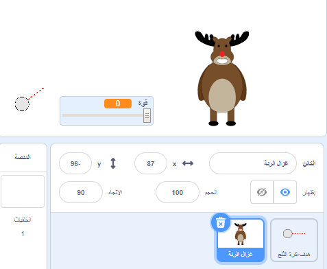
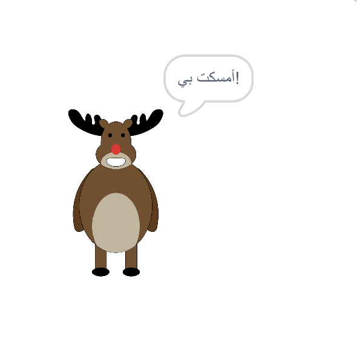
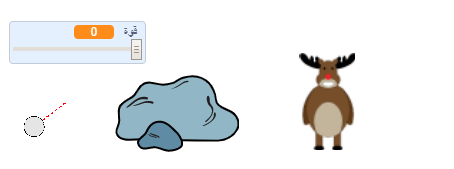

## الهدف

دعنا نضيف هدفًا لكرات الثلج الخاصة بك!

--- task ---

أضف كائن آخر إلى مشروعك.



[[[generic-scratch3-sprite-from-library]]]

--- /task ---

--- task ---

أضف هذه التعليمات البرمجية إلى الكائن الجديد الخاص بك، بحيث تقول "امسكت بي!" عندما تضرب:


```blocks3
when flag clicked
forever
    if < touching [كرة الثلج v]? > then
        say [أمسكت بي!] for (1) seconds
    end
end
```

--- /task ---

--- task ---

اختبر الكود الجديد الخاص بك.



--- /task ---

--- task ---

دعونا نفعل بعض الأشياء لجعل اللعبة أصعب. أولا، دعونا نحرك غزال الرنة في كل مرة يرمي فيها اللاعب كرة الثلج.

للقيام بذلك، أولاً أضف `بث `{:class="block3control"} إلى كرة الثلج، بالقرب من أعلى حلقة `للأبد`{:class="block3control"}. وهذا سيجعل غزال الرنة يعرف أن طلقة جديدة على وشك أن تطلق.


```blocks3
when flag clicked
forever
set [قوة v] to (0)
+broadcast (لقطة جديدة v)
wait (0.5) seconds
go to x:(-200) y:(-130)
point in direction (90)
switch costume to (هدف كرة الثلج v)
show
repeat until <mouse down?>
    point towards (mouse-pointer v)
end
repeat until < not <mouse down?> >
    point towards (mouse-pointer v)
    change [قوة v] by (1)
    wait (0.1) seconds
end
broadcast (رمي v) and wait
end
```

عندما يتلقى غزال الرنة هذه الرسالة، قم بنقلها إلى موضع عشوائي جديد باستخدام هذه التعليمة البرمجية:


```blocks3
when I receive [لقطة جديدة v]
set x to (pick random (0) to (200))
```

--- /task ---

--- task ---

اختبر مشروعك برمي بعض كرات الثلج. هل يتحرك الهدف الخاص بك في كل مرة؟

--- /task ---

--- task ---

يمكنك أيضا جعل لعبتك أصعب من خلال إضافة صخرة أمام كرة الثلج.



--- /task ---

--- task ---

يمكنك الآن تغيير التعليمة البرمجية لكرة الثلج الخاص بك، للتوقف عندما يلمس حافة الشاشة _أو_ عندما يلمس الصخور.


```blocks3
when I receive [رمي v]
switch costume to (كرة الثلج v)
+ repeat until << touching [edge v]? > or <touching [صخور v]?>>
    change y by (-5)
    move (قوة) steps
    if <(قوة) > [0]> then
    change [قوة v] by (-0.25)
    end
end
hide
```

--- /task ---

--- task ---

أخيرًا ، يمكنك أن تجعل لعبتك أكثر صعوبة من خلال جعل كرة الثلج الخاصة بك وحيوان الرنة أصغر.


--- /task ---
