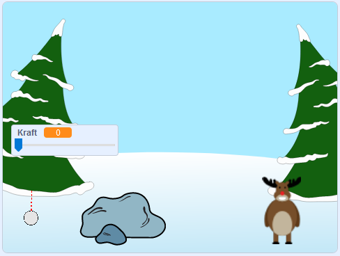

--- no-print ---

Dies ist die **Scratch 3** Version des Projekts. Es gibt auch eine [Scratch 2 Version des Projekts](https://projects.raspberrypi.org/en/projects/snowball-fight-scratch2).

--- /no-print ---

## Einleitung

In diesem Projekt wirst du ein Spiel erstellen, in dem du Schneebälle auf ein Ziel werfen musst.

### Was du machen wirst

--- no-print ---

Benutze die Maus um den Wurfwinkel des Schneeballs festzulegen und halte die Maustaste gedrückt, um mehr Kraft in den Wurf zu legen.

  <iframe allowtransparency="true" width="485" height="402" src="https://scratch.mit.edu/projects/embed/302159331/?autostart=true" frameborder="0" scrolling="no"></iframe>
  

--- /no-print ---

--- print-only ---

--- /print-only ---

--- collapse ---
---
title: Was du brauchen wirst
---

### Hardware

+ Ein Computer, auf dem Scratch ausgeführt werden kann

### Software

+ Scratch 3 (entweder [online](http://rpf.io/scratchon){:target="_blank"} oder [offline](http://rpf.io/scratchoff){:target="_blank"})

### Downloads

Das Start-Projekt findest du [hier](http://rpf.io/p/en/snowball-fight-go){:target="_blank"}.

--- /collapse ---

--- collapse ---
---
title: Was du lernen wirst
---

- Wie man Figuren animiert
- Wie man auf Mauseingaben reagiert
- Wie man Nachrichten benutzt

--- /collapse ---

--- collapse ---
---
title: Zusätzliche Informationen für Pädagogen
---

--- no-print ---

Wenn du dieses Projekt ausdrucken möchtest, verwende die [druckerfreundliche Version](https://projects.raspberrypi.org/en/projects/snowball-fight/print){:target="_blank"}.

--- /no-print ---

Du findest das [abgeschlossene Projekt hier](http://rpf.io/p/en/snowball-fight-get){:target="_blank"}.

--- /collapse ---
