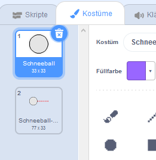
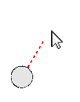
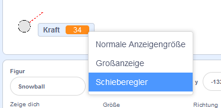
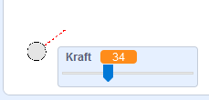

## Einen Schneeball formen

Lass uns einen Schneeball machen, den du auf deiner Bühne herum werfen kannst.

--- task ---

Öffne das Scratch Start-Projekt.

**Online**: Öffne das [Starter-Projekt](https://scratch.mit.edu/projects/405973862){:target="_blank"}.

Wenn du bereits einen Scratch-Account besitzt, kannst du dir durch Klick auf **Remix** eine Kopie anlegen.

**Offline**: Öffne das [Start-Projekt](https://rpf.io/p/de-DE/snowball-fight-go){:target="_blank"} im Offline-Editor.

Wenn du Scratch herunterladen und auf deinem Rechner installieren möchtest, dann findest du die Datei unter diesem Link: [rpf.io/scratchoff](https://rpf.io/scratchoff){:target="_blank"}.

Im Startprojekt solltest du eine leere Bühne und eine Schneeball-Figur sehen.

--- /task ---

--- task ---

Die "Schneeball"-Figur hat 2 Kostüme, ein normales Kostüm und eines, das zeigt in welche Richttung der Schneeball zeigt.



--- /task ---

--- task ---

Lass uns zuerst dem Spieler erlauben, den Winkel des Schneeballs zu ändern. Füge diesen Code deiner Schneeball-Figur hinzu:


```blocks3
when flag clicked
wait (0.5) seconds
go to x:(-200) y:(-130)
point in direction (90)
switch costume to (Schneeball-zielen v)
repeat until <mouse down?>
    point towards (mouse-pointer v)
end
```

--- /task ---

--- task ---

Teste dein Projekt, indem du auf die grüne Flagge klickst. Du solltest sehen, dass dein Schneeball der Maus folgt, bis du die Maustaste drückst.



--- /task ---

--- task ---

Lass uns dem Spieler auch erlauben, darüber zu entscheiden, wie kräftig der Schneeball geworfen werden soll. Erstelle eine neue Variable namens `Kraft`{:class="block3variable"}.

[[[generic-scratch3-add-variable]]]

--- /task ---

--- task ---

Ziehe deine neue Variablen-Anzeige an den unteren Rand der Bühne, in die Nähe des Schneeballs. Klicke mit der rechten Maustaste auf die Variablen-Anzeige und klicke auf "Schieberegler".



--- /task ---

--- task ---

Füge einen Code hinzu, um deine neue `Kraft`{:class="block3variables"} Variable auf 0 zu setzen, wenn die Flagge angeklickt wird.


```blocks3
when flag clicked
+ set [Kraft v] to (0)
```

--- /task ---

--- task ---

Jetzt, da du eine `Kraft`{:class="block3variables"} Variable hast, kannst du mit diesem Code die Kraft des Schneeballs erhöhen, _nachdem_ die Richtung gewählt wurde:


```blocks3
repeat until <mouse down?>
    point towards (mouse-pointer v)
end
+repeat until < not <mouse down?> >
    point towards (mouse-pointer v)
    change [Kraft v] by (1)
    wait (0.1) seconds
end
```

Dieser Code bedeutet, dass du _die Maustaste gedrückt halten_ musst, nachdem du die Richtung gewählt hast, um die Kraft des Schneeballs zu wählen.

--- /task ---

--- task ---

Teste deinen Schneeball, um zu sehen, ob du seinen Winkel und deine Kraft wählen kannst.



--- /task ---
