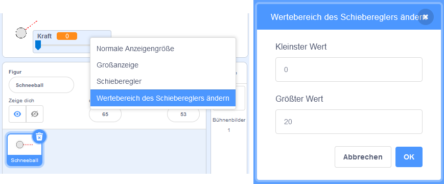

## Realistische Bewegung

Du hast jetzt einen Schneeball, aber lass uns ihn etwas realistischer bewegen.

--- task ---

Legen wir zuerst ein Maximum an Kraft fest, damit der Schneeball nicht zu fest geworfen werden kann.

In deinem Schneeball `Wenn Flagge angeklickt wird`{:class="block3events"} Code, musst du die Kraft nur erhöhen, wenn sie weniger als 20 ist. Ändere deinen Code zu:


```blocks3
repeat until< not <mouse down?> >
+   if < (power) < [20] > then
        change [power v] by (1)
        wait (0.1) seconds
    end
end
```

--- /task ---

--- task ---

Teste deinen Schneeball noch einmal, und du wirst sehen, dass die Kraft nie über 20 steigt.

--- /task ---

--- task ---

Jetzt, da die maximale Kraft deines Schneeballs 20 beträgt, kannst du dies auch als Maximalwert für den Schieberegler der Variablen festlegen. Klicke mit der rechten Maustaste auf deine Kraft Variable und klicke dann auf "Wertebereich des Schiebereglers ändern".




--- /task ---

--- task ---

Du kannst den Schneeball auch langsamer werden lassen, indem du die Kraft langsam reduzierst, während er durch die Luft fliegt. Füge diesen Code-Block zu deinem Schneeball `Wenn ich [throw] empfange`{:class="block3events"} Code hinzu:


```blocks3
when I receive [throw v]
switch costume to (snowball v)
repeat until < touching [edge v]? >
    move (power) steps
+   change [power v] by (-0.25)
end
hide
```

--- /task ---


--- task ---

Teste diesen neuen Code - funktioniert er wie du es erwartet hast? Du wirst vielleicht bemerken, dass die Kraft immer geringer wird und dass sich der Schneeball schließlich rückwärts bewegt!

Um dies zu beheben, kannst du einen `wenn`{:class="block3control"} Block zu deinem Code hinzufügen, sodass die Kraft nur gesenkt wird, wenn sie über 0 ist:


```blocks3
when I receive [throw v]
switch costume to (snowball v)
repeat until < touching [edge v]? >
    move (power) steps
+   if < (power) > (0) > then
        change [power v] by (-0.25)
    end
end
hide
```

--- /task ---

--- task ---

Du hast es fast geschafft, aber du musst deinem Schneeball noch ein bisschen Schwerkraft hinzufügen, damit er zu Boden fällt. Du kannst Schwerkraft hinzufügen, indem du den Schneeball mit diesem Code kontinuierlich nach unten bewegst:


```blocks3
when I receive [throw v]
switch costume to (snowball v)
repeat until < touching [edge v]? >
+   change y by (-5)
    move (power) steps
    if < (power) > (0) > then
        change [power v] by (-0.25)
    end
end
hide
```

--- /task ---

--- task ---

Teste deinen Schneeball nochmal und du solltest sehen, dass sich dein Schneeball wesentlich realistischer bewegt.

--- /task ---

