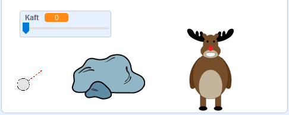

## Das Ziel

Lass uns ein Ziel für deine Schneebälle hinzufügen!

--- task ---

Füge deinem Projekt noch eine andere Figur hinzu.


[[[generic-scratch3-sprite-from-library]]]

--- /task ---

--- task ---

Füge diesen Code zu deiner neuen Figur hinzu, so dass sie sagt: "Du hast mich getroffen!" wenn sie getroffen wird:


```blocks3
when flag clicked
forever
    if < touching [snowball v]? > then
        say [You got me!] for (1) seconds
    end
end
```

--- /task ---

--- task ---

Teste deinen neuen Code.


--- /task ---

--- task ---

Lass uns ein paar Dinge tun, um das Spiel schwieriger zu machen. Lass uns zuerst das Rentier jedes Mal bewegen, wenn der Spieler einen Schneeball geworfen hat.

Um dies zu tun, füge zuerst einen `sende Nachricht`{:class="block3control"}-Block zu deinem Schneeball, neben den Kopf deiner `wiederhole fortlaufend`{:class="block3control"} Schleife, hinzu. Das wird dein Rentier wissen lassen, dass ein neuer Schuss bevorsteht.


```blocks3
when flag clicked
forever
set [power v] to (0)
+broadcast (new shot v)
wait (0.5) seconds
go to x:(-200) y:(-130)
point in direction (90)
switch costume to (snowball-aim v)
show
repeat until <mouse down?>
    point towards (mouse-pointer v)
end
repeat until < not <mouse down?> >
    point towards (mouse-pointer v)
    change [power v] by (1)
    wait (0.1) seconds
end
broadcast (throw v) and wait
end
```

Wenn dein Rentier diese Nachricht erhält, bewege es an eine neue zufällige Position mit diesem Code:


```blocks3
when I receive [new shot v]
set x to (pick random (0) to (200))
```

--- /task ---

--- task ---

Teste dein Projekt, indem du ein paar Schneebälle wirfst. Bewegt sich dein Ziel jedes Mal?

--- /task ---

--- task ---

Du kannst dein Spiel auch schwieriger machen, indem du einen Stein vor deinem Schneeball hinzufügst.



--- /task ---

--- task ---

Du kannst jetzt deinen Schneeballcode ändern, um ihn zu stoppen, wenn er den Rand des Bildschirms _oder_ wenn er den Stein berührt.


```blocks3
when I receive [throw v]
switch costume to (snowball v)
+ repeat until << touching [edge v]? > or <touching [Rocks v]?>>
    change y by (-5)
    move (power) steps
    if <(power) > [0]> then
    change [power v] by (-0.25)
    end
end
hide
```

--- /task ---

--- task ---

Schließlich kannst du dein Spiel schwerer machen, indem du deinen Schneeball und dein Rentier verkleinerst.


--- /task ---
