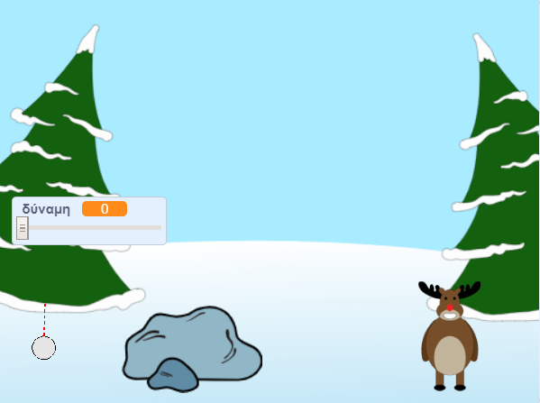

--- no-print ---

Αυτή είναι η έκδοση **Scratch 3** του έργου. Υπάρχει επίσης η [έκδοση Scratch 2 του έργου](https://projects.raspberrypi.org/en/projects/snowball-fight-scratch2).

--- /no-print ---

## Εισαγωγή

Σε αυτό το έργο πρόκειται να φτιάξεις ένα παιχνίδι στο οποίο θα ρίχνεις χιονόμπαλες σε έναν στόχο.

### Τι θα φτιάξεις

--- no-print ---

Χρησιμοποίησε το δείκτη του ποντικιού για να επιλέξεις γωνία ρίψης της χιονόμπαλας και κράτησε πατημένο το κουμπί του ποντικιού για να επιλέξεις τη δύναμη ρίψης της χιονόμπαλας.

  <iframe allowtransparency="true" width="485" height="402" src="https://scratch.mit.edu/projects/embed/302159331/?autostart=true" frameborder="0" scrolling="no"></iframe>
  

--- /no-print ---

--- print-only ---

--- /print-only ---

--- collapse ---
---
title: Τι θα χρειαστείς
---

### Υλικό

+ Έναν υπολογιστή ικανό να εκτελεί το Scratch

### Λογισμικό

+ Scratch 3 (either [online](https://rpf.io/scratchon){:target="_blank"} or [offline](https://rpf.io/scratchoff){:target="_blank"})

### Λήψεις

The starter project can be found [here](https://rpf.io/p/en/snowball-fight-go){:target="_blank"}.

--- /collapse ---

--- collapse ---
---
title: Τι θα μάθεις
---

- Πως να δώσεις κίνηση στα αντικείμενα
- Πώς να δημιουργείς ενέργειες που συμβαίνουν μετά το κλικ του ποντικιού
- πώς να χρησιμοποιείς τη μετάδοση μηνυμάτων

--- /collapse ---

--- collapse ---
---
title: Πρόσθετες πληροφορίες για εκπαιδευτικούς
---

--- no-print ---

Αν χρειαστεί να εκτυπώσεις αυτό το έργο, χρησιμοποίησε την [εκτυπώσιμη έκδοση](https://projects.raspberrypi.org/en/projects/snowball-fight/print)"{:target="_blank"}.

--- /no-print ---

You can find the [completed project here](https://rpf.io/p/en/snowball-fight-get){:target="_blank"}.

--- /collapse ---
