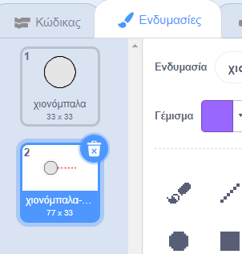
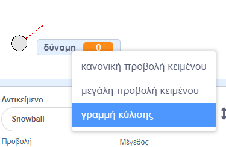
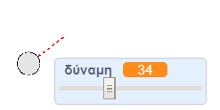

## Δημιουργώντας μία χιονόμπαλα

Ας φτιάξουμε μια χιονόμπαλα, που μπορείς να ρίξεις στο σκηνικό σου.

--- task ---

Άνοιξε το αρχικό έργο Scratch.

**Σε σύνδεση**: άνοιξε το [αρχικό έργο](http://rpf.io/snowball-fight-on){:target="_ blank"}.

Αν έχεις λογαριασμό Scratch μπορείς να κάνεις ένα αντίγραφο, κάνοντας κλικ στο κουμπί **Ανάμειξη**.

**Offline**: άνοιξε το [αρχικό έργο](http://rpf.io/p/en/snowball-fight-go){:target="_blank"} στον επεξεργαστή εκτός σύνδεσης.

Αν χρειαστεί να κατεβάσεις και να εγκαταστήσεις τον offline editor για το Scratch, μπορείς να το βρεις στο [rpf.io/scratchoff](http://rpf.io/scratchoff){:target="_blank"}.

Στο αρχικό έργο, θα δεις ένα λευκό σκηνικό και ένα αντικείμενο χιονόμπαλα.

--- /task ---

--- task ---

Το αντικείμενο «Χιονόμπαλα» περιέχει 2 ενδυμασίες, μία κανονική και μία που δείχνει προς ποια κατεύθυνση είναι στραμμένη η χιονόμπαλα.



--- /task ---

--- task ---

Αρχικά, ας επιτρέψουμε στον παίκτη να αλλάξει τη γωνία ρίψης της χιονόμπαλας. Πρόσθεσε αυτόν τον κώδικα στο αντικείμενο της χιονόμπαλας:


```blocks3
when flag clicked
wait (0.5) seconds
go to x:(-200) y:(-130)
point in direction (90)
switch costume to (snowball-aim v)
repeat until <mouse down?>
    point towards (mouse-pointer v)
end
```

--- /task ---

--- task ---

Δοκίμασε το έργο σου κάνοντας κλικ στην πράσινη σημαία. Θα δεις ότι η χιονόμπαλα ακολουθεί το ποντίκι, μέχρι να πατήσεις το κουμπί του ποντικιού.


--- /task ---

--- task ---

Let's also allow the player to decide on how powerful the snowball should be thrown. Create a new variable called `power`{:class="block3variables"}.

[[[generic-scratch3-add-variable]]]

--- /task ---

--- task ---

Drag your new variable display to the bottom of the stage, near the snowball. Right-click on the variable display and click 'slider'.



--- /task ---

--- task ---

Add code to set your new `power`{:class="block3variables"} variable to 0 when the flag is clicked.


```blocks3
when flag clicked
+ set [power v] to (0)
```

--- /task ---

--- task ---

Now that you have a `power`{:class="block3variables"} variable, you can increase the power of the snowball _after_ the direction has been chosen with this code:


```blocks3
repeat until <mouse down?>
    point towards (mouse-pointer v)
end
+repeat until < not <mouse down?> >
    point towards (mouse-pointer v)
    change [power v] by (1)
    wait (0.1) seconds
end
```

This code means that you have to _keep the mouse button held down_ after choosing the direction, to choose the snowball's power.

--- /task ---

--- task ---

Test your snowball, to see if you can choose its angle and power.



--- /task ---
