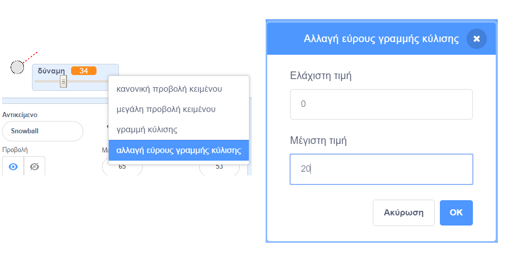

## Ρεαλιστική κίνηση

Τώρα έχεις μια χιονόμπαλα, αλλά ας την κάνουμε να κινείται λίγο πιο ρεαλιστικά.

--- task ---

Αρχικά, ας ορίσουμε ένα μέγιστο όριο δύναμης, έτσι ώστε η χιονόμπαλα να μην μπορεί να εκτοξευτεί πολύ δυνατά.

Στον κώδικα `όταν κάνεις κλικ στη σημαία`{:class="block3events"} της χιονόμπαλάς σου, χρειάζεται να αυξήσουμε τη δύναμη μόνο εάν είναι μικρότερη από 20. Άλλαξε τον κώδικά σου σε:


```blocks3
repeat until< not <mouse down?> >
+   if < (δύναμη) < [20] > then
        change [δύναμη v] by (1)
        wait (0.1) seconds
    end
end
```

--- /task ---

--- task ---

Δοκίμασε ξανά τη χιονόμπαλά σου και θα δεις ότι η δύναμη δεν ξεπερνά ποτέ την τιμή 20.

--- /task ---

--- task ---

Τώρα που η μέγιστη δύναμη ρίψης της χιονόμπαλάς σου είναι 20, μπορείς να την ορίσεις ως τη μέγιστη τιμή και για τη γραμμή κύλισης της μεταβλητής. Κάνε δεξί κλικ στη μεταβλητή δύναμής σου και κάνε κλικ στο "αλλαγή εύρους γραμμής κύλισης".




--- /task ---

--- task ---

Μπορείς επίσης να επιβραδύνεις τη χιονόμπαλα, μειώνοντας ελαφρώς τη δύναμη καθώς πετάει στον αέρα. Πρόσθεσε αυτό το μπλοκ κώδικα στον κώδικα της χιονόμπαλάς σου `όταν λαμβάνω [ρίψη]`{:class="block3events"}:


```blocks3
when I receive [ρίψη v]
switch costume to (χιονόμπαλα v)
repeat until < touching [edge v]? >
    move (δύναμη) steps
+   change [δύναμη v] by (-0.25)
end
hide
```

--- /task ---


--- task ---

Δοκίμασε αυτόν τον νέο κώδικα - λειτουργεί όπως περίμενες; Μπορεί να παρατηρήσεις ότι η δύναμη συνεχίζει να μειώνεται και τελικά η χιονόμπαλα κινείται προς τα πίσω!

Για να το διορθώσεις, μπορείς να προσθέσεις ένα μπλοκ `εάν`{:class="block3control"} στον κώδικά σου, έτσι ώστε η δύναμη να μειώνεται μόνο εάν είναι πάνω από 0:


```blocks3
when I receive [ρίψη v]
switch costume to (χιονόμπαλα v)
repeat until < touching [edge v]? >
    move (δύναμη) steps
+   if < (δύναμη) > (0) > then
        change [δύναμη v] by (-0.25)
    end
end
hide
```

--- /task ---

--- task ---

Είσαι σχεδόν έτοιμος, αλλά πρέπει επίσης να προσθέσεις βαρύτητα στη χιονόμπαλά σου, έτσι ώστε να πέσει στο έδαφος. Μπορείς να προσθέσεις βαρύτητα μετακινώντας συνεχώς τη χιονόμπαλα προς τα κάτω με αυτόν τον κώδικα:


```blocks3
when I receive [ρίψη v]
switch costume to (χιονόμπαλα v)
repeat until < touching [edge v]? >
+   change y by (-5)
    move (δύναμη) steps
    if < (δύναμη) > (0) > then
        change [δύναμη v] by (-0.25)
    end
end
hide
```

--- /task ---

--- task ---

Δοκίμασε ξανά τη χιονόμπαλά σου και θα δεις ότι η χιονόμπαλά σου κινείται πολύ πιο ρεαλιστικά.

--- /task ---

