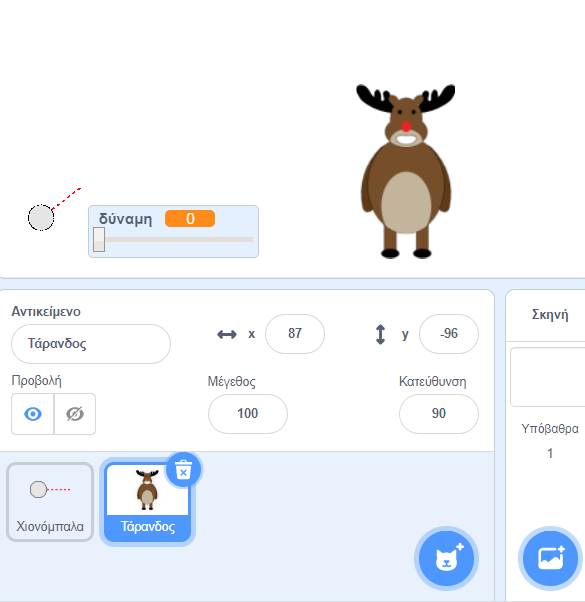
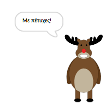
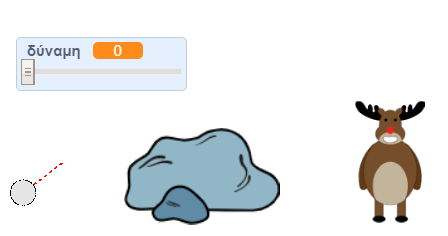

## Ο στόχος

Ας προσθέσουμε έναν στόχο για τις χιονόμπαλές σου!

--- task ---

Πρόσθεσε ακόμη ένα αντικείμενο στο έργο σου.



[[[generic-scratch3-sprite-from-library]]]

--- /task ---

--- task ---

Πρόσθεσε αυτόν τον κώδικα στο νέο σου αντικείμενο, ώστε να λέει "Με πέτυχες!" όταν χτυπηθεί:


```blocks3
when flag clicked
forever
    if < touching [snowball v]? > then
        say [You got me!] for (1) seconds
    end
end
```

--- /task ---

--- task ---

Δοκίμασε το νέο σου κώδικα.



--- /task ---

--- task ---

Ας κάνουμε μερικά πράγματα για να κάνουμε το παιχνίδι πιο δύσκολο. Αρχικά, ας μετακινήσουμε τον τάρανδο κάθε φορά που ο παίκτης ρίχνει τη χιονόμπαλα.

Για να το κάνεις αυτό, πρώτα προσθέστε μια `μετάδοση μηνύματος`{:class="block3control"} στη χιονόμπαλά σου, στο πάνω μέρος του βρόχου `για πάντα`{:class="block3control"}. Αυτό θα ενημερώσει τον τάρανδό σου ότι πρόκειται να ριφθεί μια νέα βολή.


```blocks3
when flag clicked
forever
set [power v] to (0)
+broadcast (new shot v)
wait (0.5) seconds
go to x:(-200) y:(-130)
point in direction (90)
switch costume to (snowball-aim v)
show
repeat until <mouse down?>
    point towards (mouse-pointer v)
end
repeat until < not <mouse down?> >
    point towards (mouse-pointer v)
    change [power v] by (1)
    wait (0.1) seconds
end
broadcast (throw v) and wait
end
```

Όταν ο τάρανδός σου λάβει αυτό το μήνυμα, μετακίνησέ τον σε μια νέα τυχαία θέση με αυτόν τον κώδικα:


```blocks3
when I receive [new shot v]
set x to (pick random (0) to (200))
```

--- /task ---

--- task ---

Δοκίμασε το έργο σου ρίχνοντας μερικές χιονόμπαλες. Ο στόχος σου αλλάζει θέση κάθε φορά;

--- /task ---

--- task ---

Μπορείς επίσης να κάνεις το παιχνίδι σου πιο δύσκολο προσθέτοντας ένα βράχο μπροστά από τη χιονόμπαλά σου.


--- /task ---

--- task ---

Τώρα μπορείς να αλλάξεις τον κώδικα της χιονόμπαλας, για να σταματήσει, όταν αγγίξει την άκρη της οθόνης _ή_ όταν αγγίξει τον βράχο.


```blocks3
when I receive [throw v]
switch costume to (snowball v)
+ repeat until << touching [edge v]? > or <touching [Rocks v]?>>
    change y by (-5)
    move (power) steps
    if <(power) > [0]> then
    change [power v] by (-0.25)
    end
end
hide
```

--- /task ---

--- task ---

Τέλος, μπορείς να κάνεις το παιχνίδι σου πιο δύσκολο κάνοντας τη χιονόμπαλα και τον τάρανδό σου μικρότερα.



--- /task ---
