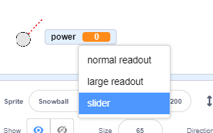

## Making a snowball

Let's make a snowball, that you can throw around your stage.


+ Open the ‘Snowball Fight’ Scratch project online at [jumpto.cc/snowball-go](http://jumpto.cc/snowball-go){target="_blank"} or download from [jumpto.cc/snowball-get](http://jumpto.cc/snowball-get) and then open if you are using the offline editor.

+ The 'Snowball' sprite contains 2 costumes, a normal costume, and one that shows which direction the snowball is facing.

	

+ First, let's allow the player to change the angle of the snowball. Add this code to your snowball sprite:

	```blocks
		when flag clicked
		wait (0.5) secs
		go to x:(-200) y:(-130)
		point in direction (90 v)
		switch costume to [snowball-aim v]
		repeat until <key [space v] pressed?>
			point towards [mouse-pointer v]
		end
	```

+ Test out your project by clicking the green flag. You should see that your snowball follows the mouse, until you press the space bar.

	

+ Let's also allow the player to deicde on how powerful the snowball should be thrown. Create a new variable called `power`{:class="blockdata"}.

	

+ Drag your new variable display to the bottom of the stage, near the snowball. Right-click on the variable display and click 'slider'.

	

+ Add code to set your new `power`{:class="blockdata"} variable to 0 when the flag is clicked.

	```blocks
		set [power v] to (0)
	```

+ Now that you have a `power`{:class="blockdata"} variable, you can increase the power of the snowball _after_ the direction has been chosen with this code:

	```blocks
		repeat until < not <key [space v] pressed?> >
			change [power v] by (1)
			wait (0.1) secs
		end
	```

	This code means that you have to _keep the space bar held down_ after choosing the direction, to choose the snowball's power.

+ Test your snowball, to see if you can choose its angle and power.

	

