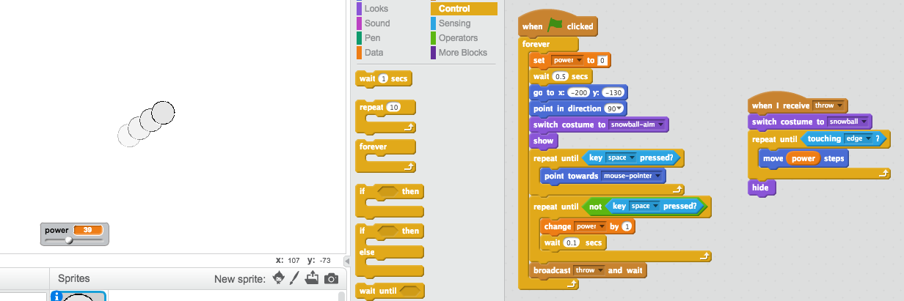

## Throwing a snowball


+ Add this code to the _end_ of your snowball script, to broadcast that you're throwing a snowball:

	```blocks
		broadcast [throw v] and wait
	```

	Here's how your snowball code should look:

	```blocks
		when flag clicked
		wait (0.5) secs
		go to x:(-200) y:(-130)
		point in direction (90 v)
		switch costume to [snowball-aim v]
		repeat until <key [space v] pressed?>
			point towards [mouse-pointer v]
		end
		repeat until < not <key [space v] pressed?> >
			change [power v] by (1)
			wait (0.1) secs
		end
		broadcast [throw v] and wait
	```

+ Add this script to your snowball, to move until it reaches the edge of the stage:

	```blocks
		when I receive [throw v]
		switch costume to [snowball v]
		repeat until < touching [edge v]? >
			move (power) steps
		end
		hide
	```

	The script uses the `power`{:class="blockdata"} variable to decide how fast to move.

+ Now that you're hiding the snowball when it touches the edge, add code to `show`{:class="blocklooks"} the snowball when the flag is clicked, _just_ after the snowball switches to the `snowball-aim`{:class="blocklooks"} costume.

	

+ Test out your snowball a few times. Does it move at different angles and different speeds?

+ If you want to be able to throw your snowball lots of times, just add a `forever`{:class="blockcontrol"} loop around your snowball `when flag clicked`{:class="blockevents"} code.

	

