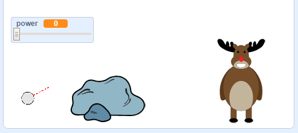

## The target

Let's add in a target for your snowballs!


+ Add in another sprite to your project.

	

+ Add this code to your new sprite, so that it says "You got me!" when it gets hit:

	```blocks
		when flag clicked
		forever
			if < touching [snowball v]? > then
				say [You got me!] for (1) secs
			end
		end
	```

+ Test out your new code.

	

+ Let's do a couple of things to make the game harder. First, let's move the bear each time the player throws the snowball.

	To do this, first add a `broadcast`{:class="blockcontrol"} to your snowball, near the top of your `forever`{:class="blockcontrol"} loop. This will let your bear know that a new shot is about to be taken.

	```blocks
		broadcast [new shot v]
	```

+ When your bear receives this message, move it to a new random position with this code:

	```blocks
		when I receive [new shot v]
		set x to (pick random (0) to (200))
	```

+ Test your project by throwing a few snowballs. Does your bear move position each time?

+ You can also make your game harder by adding a rock in front of your snowball.

	

+ You can now change your snowball code, to stop when it touches the edge of the screen _or_ when it touches the rock. Here's how your snowball code should look:

	

+ Finally, you can make your game harder by making your snowball and your bear smaller.

	

