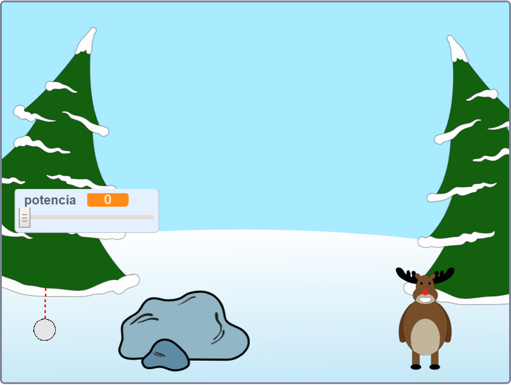

--- no-print ---

Esta es la versión **Scratch 3** del proyecto. También hay una [versión del proyecto en Scratch 2](https://projects.raspberrypi.org/es-ES/projects/snowball-fight-scratch2).

--- /no-print ---

## Introducción

En este proyecto vas a hacer un juego en el que tienes que lanzar bolas de nieve a un objetivo.

### Lo que harás

--- no-print ---

Usa el puntero del ratón para inclinar la bola de nieve y mantén presionado el botón del ratón para elegir la potencia de la bola de nieve.

  <iframe allowtransparency="true" width="485" height="402" src="https://scratch.mit.edu/projects/embed/420109153/?autostart=true" frameborder="0" scrolling="no"></iframe>
  

--- /no-print ---

--- print-only ---

--- /print-only ---

--- collapse ---
---
title: Lo que necesitarás
---

### Hardware

+ Un ordenador capaz de ejecutar Scratch

### Software

+ Scratch 3 (ya sea [online](https://rpf.io/scratchon){:target="_blank"} u [offline](https://rpf.io/scratchoff){:target="_blank"})

### Descargas

El proyecto de iniciación puede encontrarse [aquí](https://rpf.io/p/es-ES/snowball-fight-go){:target="_blank"}.

--- /collapse ---

--- collapse ---
---
title: Lo que vas a aprender
---

- Cómo hacer objetos animados
- Cómo reaccionar a las acciones del ratón
- Cómo usar eventos

--- /collapse ---

--- collapse ---
---
title: Información adicional para educadores
---

--- no-print ---

Si necesitas imprimir este proyecto, usa la [versión para imprimir](https://projects.raspberrypi.org/es-ES/projects/snowball-fight/print){:target="_blank"}.

--- /no-print ---

Puedes [encontrar el proyecto completo aquí](https://rpf.io/p/es-ES/snowball-fight-get){:target="_blank"}.

--- /collapse ---
