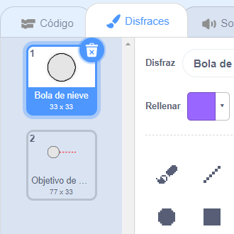
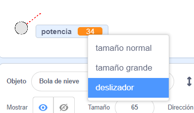
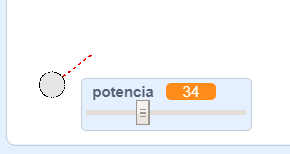

## Haciendo una bola de nieve

Vamos a hacer una bola de nieve que puedes lanzar alrededor de tu escenario.

--- task ---

Abre el proyecto inicial de Scratch.

**Online**: abre el [proyecto inicial](https://scratch.mit.edu/projects/420109470){:target="_blank"}.

Si tienes una cuenta de Scratch puedes hacer una copia haciendo clic en **Reinventar**.

**Offline**: abre el [proyecto inicial](https://rpf.io/p/es-ES/snowball-fight-go){:target=_blank"} en el editor offline.

Si necesitas descargar e instalar el editor offline de Scratch, puedes encontrarlo en [rpf.io/scratchoff](https://rpf.io/scratchoff){:target="_blank"}.

En el proyecto de iniciación deberías ver un escenario en blanco y un objeto de una bola de nieve.

--- /task ---

--- task ---

El objeto "Bola de nieve" contiene 2 disfraces: un disfraz normal y otro que muestra la dirección hacia dónde se dirige la bola de nieve.



--- /task ---

--- task ---

Primero, vamos a dejar que el jugador cambie el ángulo de la bola de nieve. Añade este código al objeto bola de nieve:


```blocks3
when flag clicked
wait (0.5) seconds
go to x:(-200) y:(-130)
point in direction (90)
switch costume to (Objetivo bola de nieve v)
repeat until <mouse down?>
    point towards (mouse-pointer v)
end
```

--- /task ---

--- task ---

Prueba tu proyecto haciendo clic en la bandera verde. Deberías ver que la bola de nieve sigue al ratón hasta que pulses el botón del ratón.


--- /task ---

--- task ---

También vamos a permitir que el jugador decida la potencia con la que quiere lanzar la bola de nieve. Crea una nueva variable llamada `potencia`{:class="block3variables"}.

[[[generic-scratch3-add-variable]]]

--- /task ---

--- task ---

Arrastra tu nueva variable a la parte inferior del escenario, cerca de la bola de nieve. Haz clic derecho con el ratón sobre la variable y haz clic en 'deslizador'.



--- /task ---

--- task ---

Añade código para poner tu nueva variable `potencia`{:class="block3variables"} a 0 cuando se haga clic en la bandera.


```blocks3
when flag clicked
+ set [potencia v] to (0)
```

--- /task ---

--- task ---

Ahora que tienes la variable `potencia`{:class="block3variables"} puedes aumentar la potencia de la bola de nieve _hacia_ una dirección. El siguiente código determina la dirección:


```blocks3
repeat until <mouse down?>
    point towards (mouse-pointer v)
end
+repeat until < not <mouse down?> >
    point towards (mouse-pointer v)
    change [potencia v] by (1)
    wait (0.1) seconds
end
```

Este código significa que para poder elegir la potencia de la bola de nieve primero tienes que decidir la dirección y después _mantener presionado el botón del ratón_.

--- /task ---

--- task ---

Prueba tu bola de nieve para ver si puedes elegir su ángulo y potencia.



--- /task ---
