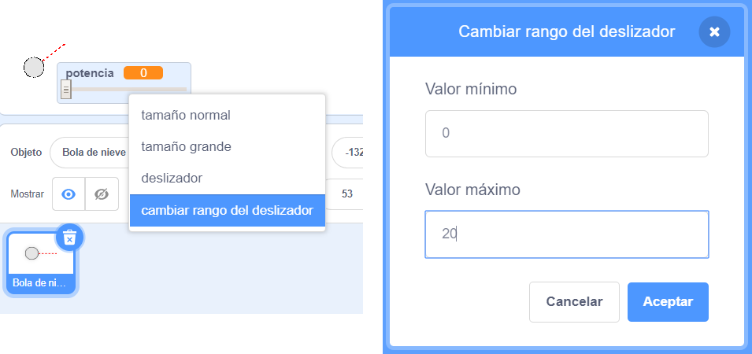

## Movimiento realista

Ahora tienes una bola de nieve, pero hagamos que se mueva de manera un poco más realista.

--- task ---

Primero, vamos a establecer un nivel de potencia máxima para que no se pueda lanzar la bola de nieve con demasiada fuerza.

En el código `cuando hagas clic en la bandera`{:class="block3events"} de tu bola de nieve necesitamos aumentar la potencia sólo si es inferior a 20. Cambia tu código a:


```blocks3
repeat until< not <mouse down?> >
+   if < (potencia) < [20] > then
        change [potencia v] by (1)
        wait (0.1) seconds
    end
end
```

--- /task ---

--- task ---

Prueba otra vez tu bola de nieve y verás que la potencia nunca supera los 20.

--- /task ---

--- task ---

Ahora que la potencia máxima de tu bola de nieve es 20 puedes establecerlo como el valor máximo para el deslizador de la variable. Haz clic derecho sobre la variable de potencia y haz clic en 'fijar el control deslizante mínimo y máximo'.




--- /task ---

--- task ---

También puedes ralentizar la bola de nieve reduciendo la potencia ligeramente a medida que vuela por el aire. Añade este bloque de código al código de la bola de nieve `al recibir [lanzar]`{:class="block3events"}:


```blocks3
when I receive [lanzar v]
switch costume to (Bola de nieve v)
repeat until < touching [edge v]? >
    move (potencia) steps
+   change [potencia v] by (-0.25)
end
hide
```

--- /task ---


--- task ---

Prueba este nuevo código - ¿funciona como esperabas? Puedes notar que la potencia sigue reduciéndose, ¡e incluso la bola de nieve llega a moverse hacia atrás!

Para arreglar esto puedes añadir a tu código un bloque `si`{:class="block3control"} para que la potencia solo se reduzca si está por encima de 0:


```blocks3
when I receive [lanzar v]
switch costume to (Bola de nieve v)
repeat until < touching [edge v]? >
    move (potencia) steps
+   if < (potencia) > (0) > then
        change [potencia v] by (-0.25)
    end
end
hide
```

--- /task ---

--- task ---

Ya casi está, pero también necesitas añadir algo de gravedad a tu bola de nieve, para que caiga al suelo. Puedes añadir el efecto de la gravedad haciendo que la bola de nieve se mueva continuamente hacia abajo con este código:


```blocks3
when I receive [lanzar v]
switch costume to (Bola de nieve v)
repeat until < touching [edge v]? >
+   change y by (-5)
    move (potencia) steps
    if < (potencia) > (0) > then
        change [potencia v] by (-0.25)
    end
end
hide
```

--- /task ---

--- task ---

Prueba de nuevo tu bola de nieve y verás que se mueve de forma mucho más realista.

--- /task ---

