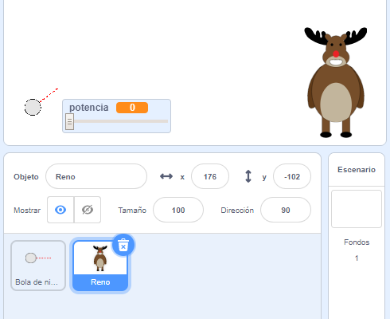
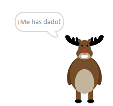
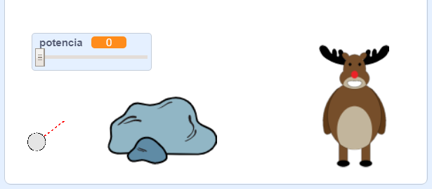
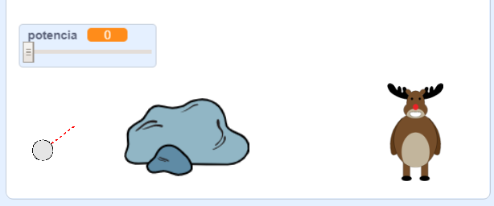

## El objetivo

¡Vamos a añadir un objetivo para tus bolas de nieve!

--- task ---

Añade otro objeto a tu proyecto.



[[[generic-scratch3-sprite-from-library]]]

--- /task ---

--- task ---

Añade este código a tu nuevo objeto para que diga "¡Me has dado!" cuando reciba un golpe:


```blocks3
when flag clicked
forever
    if < touching [Bola de nieve v]? > then
        say [¡Me has dado!] for (1) seconds
    end
end
```

--- /task ---

--- task ---

Pon a prueba tu nuevo código.



--- /task ---

--- task ---

Vamos a hacer un par de cosas para hacer el juego más difícil. Primero, vamos a mover el reno cada vez que el jugador lance la bola de nieve.

Para hacer esto, primero añade un `evento`{:class="block3control"} a tu bola de nieve, cerca de la parte superior de tu bucle `por siempre`{:class="block3control"}. Esto permitirá que tu reno sepa que alguien está a punto de lanzar una nueva bola de nieve.


```blocks3
when flag clicked
forever
set [potencia v] to (0)
+broadcast (nuevo lanzamiento v)
wait (0.5) seconds
go to x:(-200) y:(-130)
point in direction (90)
switch costume to (Objetivo bola de nieve v)
show
repeat until <mouse down?>
    point towards (mouse-pointer v)
end
repeat until < not <mouse down?> >
    point towards (mouse-pointer v)
    change [potencia v] by (1)
    wait (0.1) seconds
end
broadcast (lanzar v) and wait
end
```

Cuando tu reno reciba este mensaje, desplázalo a una nueva posición aleatoria con este código:


```blocks3
when I receive [nuevo lanzamiento v]
set x to (pick random (0) to (200))
```

--- /task ---

--- task ---

Prueba tu proyecto lanzando unas cuantas bolas de nieve. ¿Tu objetivo se mueve cada vez?

--- /task ---

--- task ---

También puedes aumentar la dificultad del juego añadiendo una roca delante de tu bola de nieve.



--- /task ---

--- task ---

Ahora puedes cambiar el código de tu bola de nieve para que se detenga cuando toque el borde de la pantalla _o_ cuando toque la roca.


```blocks3
when I receive [lanzar v]
switch costume to (Bola de nieve v)
+ repeat until << touching [edge v]? > or <touching [Rocas v]?>>
    change y by (-5)
    move (potencia) steps
    if <(potencia) > [0]> then
    change [potencia v] by (-0.25)
    end
end
hide
```

--- /task ---

--- task ---

Por último, puedes aumentar la dificultad de tu juego reduciendo el tamaño de tu bola de nieve y de tu reno.



--- /task ---
