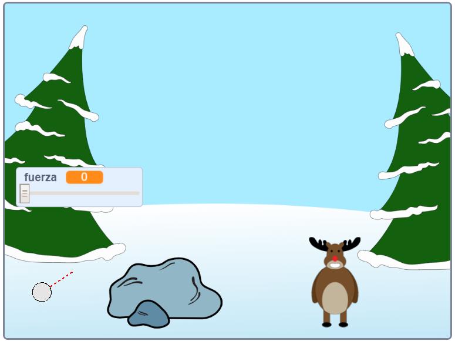

--- no-print ---

Esta es la versión **Scratch 3** del proyecto. También hay una [versión Scratch 2 del proyecto](https://projects.raspberrypi.org/en/projects/snowball-fight-scratch2).

--- /no-print ---

## Introducción

En este proyecto vas a crear un juego en el que tienes que lanzar bolas de nieve a un blanco.

### Lo que harás

--- no-print ---

Utiliza el puntero del mouse para inclinar la bola de nieve y mantén presionado el botón del mouse para elegir el poder de la bola de nieve.

  <iframe allowtransparency="true" width="485" height="402" src="https://scratch.mit.edu/projects/embed/302159331/?autostart=true" frameborder="0" scrolling="no"></iframe>
  

--- /no-print ---

--- print-only ---

--- /print-only ---

--- collapse ---
---
title: Lo que necesitarás
---

### Hardware

+ Una computadora capaz de ejecutar Scratch

### Software

+ Scratch 3 (either [online](https://rpf.io/scratchon){:target="_blank"} or [offline](https://rpf.io/scratchoff){:target="_blank"})

### Descargas

The starter project can be found [here](https://rpf.io/p/en/snowball-fight-go){:target="_blank"}.

--- /collapse ---

--- collapse ---
---
title: Lo que aprenderás
---

- Cómo animar objetos
- Cómo hacer reacciones ante los clics del mouse
- Como usar los bloques de envío

--- /collapse ---

--- collapse ---
---
title: Información adicional para educadores
---

--- no-print ---

Si necesitas imprimir este proyecto, usa la [versión para imprimir](https://projects.raspberrypi.org/en/projects/snowball-fight/print){:target="_blank"}.

--- /no-print ---

You can find the [completed project here](https://rpf.io/p/en/snowball-fight-get){:target="_blank"}.

--- /collapse ---
