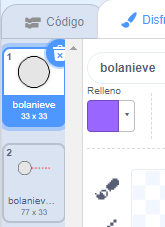
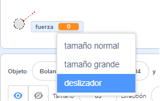
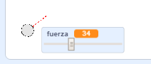

## Hacer una bola de nieve

Hagamos una bola de nieve que puedas lanzar por todo el escenario.

--- task ---

Abre el proyecto inicial de Scratch.

**En línea**: abre el [proyecto inicial](http://rpf.io/snowball-fight-on){:target="_blank"}.

Si tienes una cuenta Scratch puedes hacer una copia al hacer clic en **Reinventar**.

**Sin conexión**: abre el [proyecto inicial](http://rpf.io/p/en/snowball-fight-go){:target=_blank"} en el editor sin conexión.

Si necesitas descargar e instalar el editor sin conexión de Scratch, puedes encontrarlo en [rpf.io/scratchoff](http://rpf.io/scratchoff){:target="_blank"}.

En el proyecto inicial, deberías ver un escenario en blanco y un objeto bola de nieve.

--- /task ---

--- task ---

El objeto «Bolanieve» contiene 2 disfraces, un disfraz normal y otro que muestra en qué dirección se dirige la bola de nieve.



--- /task ---

--- task ---

Primero, permitamos que el jugador cambie el angulo de dirección de la bola de nieve. Añade este código al objeto bola de nieve:


```blocks3
when flag clicked
wait (0.5) seconds
go to x:(-200) y:(-130)
point in direction (90)
switch costume to (snowball-aim v)
repeat until <mouse down?>
    point towards (mouse-pointer v)
end
```

--- /task ---

--- task ---

Prueba tu proyecto haciendo clic en la bandera verde. Deberías ver que tu bola de nieve sigue la dirección del mouse, hasta que hagas clic.


--- /task ---

--- task ---

Permitamos que el jugador también decida qué tan fuerte se debe lanzar la bola de nieve. Crea una nueva variable que se llame `fuerza`{:class="block3variables"}.

[[[generic-scratch3-add-variable]]]

--- /task ---

--- task ---

Arrastra tu nueva variable a la parte inferior del escenario, cerca de la bola de nieve. Haz clic con el botón derecho en la variable y haz clic en «deslizador».



--- /task ---

--- task ---

Añade código para configurar el nuevo nivel de `fuerza`{:class = "block3variables"} variable a 0 cuando haces clic en la bandera.


```blocks3
when flag clicked
+ set [power v] to (0)
```

--- /task ---

--- task ---

Ahora que tienes una variable `fuerza`{: class="block3variables"}, puedes aumentar la potencia del lanzamiento de la bola de nieve, _después_ de elegir la dirección, con este código:


```blocks3
repeat until <mouse down?>
    point towards (mouse-pointer v)
end
+repeat until < not <mouse down?> >
    point towards (mouse-pointer v)
    change [power v] by (1)
    wait (0.1) seconds
end
```

Este código significa que debes _mantener presionado el botón del mouse_ después de elegir la dirección, para elegir la fuerza con la que se lanzará la bola de nieve.

--- /task ---

--- task ---

Prueba tu bola de nieve para ver si puedes elegir el angulo de dirección y la potencia.



--- /task ---
