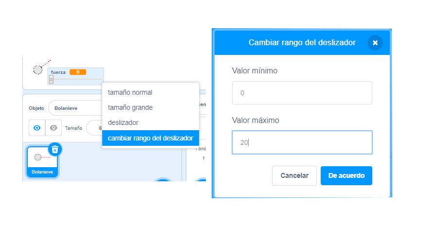

## Movimiento realista

Ahora tienes una bola de nieve, pero hagamos que se mueva de manera más realista.

--- task ---

Primero, establezcamos un nivel de potencia máximo, para que la bola de nieve no se pueda lanzar demasiado fuerte.

En el código de la bola de nieve `cuando hagas clic en la bandera`{:class="block3events"}, necesitamos aumentar la potencia solo si es inferior a 20. Cambia tu código a:


```blocks3
repeat until< not <mouse down?> >
+   if < (power) < [20] > then
        change [power v] by (1)
        wait (0.1) seconds
    end
end
```

--- /task ---

--- task ---

Prueba de nuevo tu bola de nieve y verás que la potencia nunca supera los 20.

--- /task ---

--- task ---

Ahora que la potencia máxima de tu bola de nieve es 20, también puedes establecerlo como el máximo valor para el control deslizante de la variable. Haz clic en el botón derecho en tu variable fuerza y haz clic en «establecer el control deslizante mínimo y máximo».




--- /task ---

--- task ---

También puedes bajar la velocidad de la bola de nieve, al reducir la potencia de manera ligera, a medida que vuela por el aire. Add this code block to your snowball's `when I receive [throw]`{:class="block3events"} code:


```blocks3
when I receive [throw v]
switch costume to (snowball v)
repeat until < touching [edge v]? >
    move (power) steps
+   change [power v] by (-0.25)
end
hide
```

--- /task ---


--- task ---

Prueba este nuevo código - ¿funciona como esperabas? Podrás notar que la potencia se sigue reduciendo ¡y al final la bola de nieve se moverá hacia atrás!

Para arreglar esto, puedes añadir un bloque `si`{:class="block3control"} a tu código, para que la potencia solo se reduzca si está por encima de 0:


```blocks3
when I receive [throw v]
switch costume to (snowball v)
repeat until < touching [edge v]? >
    move (power) steps
+   if < (power) > (0) > then
        change [power v] by (-0.25)
    end
end
hide
```

--- /task ---

--- task ---

Ya casi finalizas, pero primero necesitas añadir algo de gravedad a tu bola de nieve, así caerá al suelo. You can add gravity by just moving the snowball down continuously with this code:


```blocks3
when I receive [throw v]
switch costume to (snowball v)
repeat until < touching [edge v]? >
+   change y by (-5)
    move (power) steps
    if < (power) > (0) > then
        change [power v] by (-0.25)
    end
end
hide
```

--- /task ---

--- task ---

Test out your snowball again, and you should see that your snowball moves much more realistically.

--- /task ---

