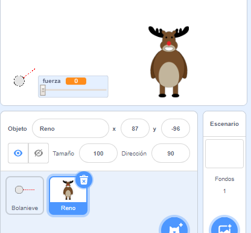

## El blanco

¡Añadamos un blanco para tus bolas de nieve!

--- task ---

Añade otro objeto a tu proyecto.



[[[generic-scratch3-sprite-from-library]]]

--- /task ---

--- task ---

Añade este código a tu nuevo objeto, para que cuando lo golpees diga: «¡Me diste!»:


```blocks3
when flag clicked
forever
    if < touching [Bolanieve v]? > then
        say [¡Me diste!] for (1) seconds
    end
end
```

--- /task ---

--- task ---

Prueba tu nuevo código.


--- /task ---

--- task ---

Hagamos un par de cosas para que el juego se ponga más difícil. Primero, movamos el reno cada vez que el jugador tire la bola de nieve.

Para esto, primero añade un `enviar`{:class="block3control"} a tu bola de nieve, cerca de la parte superior de tu bucle `para siempre`{:class="block3control"}. Esto permitirá que tu reno sepa que pronto se hará un nuevo tiro.


```blocks3
when flag clicked
forever
set [fuerza v] to (0)
+broadcast (nuevo tiro v)
wait (0.5) seconds
go to x:(-200) y:(-130)
point in direction (90)
switch costume to (Bolanieve-dirección v)
show
repeat until <mouse down?>
    point towards (mouse-pointer v)
end
repeat until < not <mouse down?> >
    point towards (mouse-pointer v)
    change [fuerza v] by (1)
    wait (0.1) seconds
end
broadcast (lanza v) and wait
end
```

Cuando tu reno reciba este mensaje, muévelo a una nueva posición aleatoria, con este código:


```blocks3
when I receive [nuevo tiro v]
set x to (pick random (0) to (200))
```

--- /task ---

--- task ---

Prueba tu proyecto al lanzar unas cuantas bolas de nieve. ¿Tu blanco cambia siempre de posición?

--- /task ---

--- task ---

También puedes aumentar la dificultad de tu juego al añadir una roca adelante de tu bola de nieve.


--- /task ---

--- task ---

Ahora puedes cambiar tu código de bola de nieve, para detenerla cuando toque el borde de la pantalla _o_ cuando toque la roca.


```blocks3
when I receive [lanza v]
switch costume to (Bolanieve v)
+ repeat until << touching [edge v]? > or <touching [Piedras v]?>>
    change y by (-5)
    move (fuerza) steps
    if <(fuerza) > [0]> then
    change [fuerza v] by (-0.25)
    end
end
hide
```

--- /task ---

--- task ---

Por último, puedes hacer tu juego más difícil al disminuir el tamaño del reno y la bola de nieve.


--- /task ---
