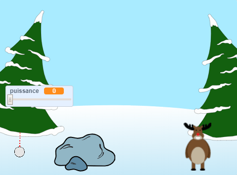

--- no-print ---

Ceci est la version **Scratch 3** du projet. Il existe également une version [Scratch 2 du projet](https://projects.raspberrypi.org/fr-FR/projects/snowball-fight-scratch2).

--- /no-print ---

## Introduction

Dans ce projet, tu vas créer un jeu dans lequel tu dois lancer des boules de neige sur une cible.

### Ce que tu feras

--- no-print ---

Utilise le pointeur de la souris pour incliner la boule de neige et maintiens le bouton de la souris enfoncé pour choisir la puissance de la boule de neige.

  <iframe allowtransparency="true" width="485" height="402" src="https://scratch.mit.edu/projects/embed/397706531/?autostart=true" frameborder="0" scrolling="no"></iframe>
  

--- /no-print ---

--- print-only ---

--- /print-only ---

--- collapse ---
---
title: Ce qu'il te faut
---

### Matériel informatique

+ Un ordinateur capable d'exécuter Scratch

### Logiciel

+ Scratch 3 (soit [en ligne](http://rpf.io/scratchon){:target="_blank"} soit [hors-ligne](http://rpf.io/scratchoff){:target="_blank"})

### Téléchargements

Le projet de démarrage peut être trouvé [ici](http://rpf.io/p/fr-FR/snowball-fight-go){:target="_blank"}.

--- /collapse ---

--- collapse ---
---
title: Ce que tu vas apprendre
---

- Comment animer les sprites
- Comment réagir à l'entrée de la souris
- comment utiliser les diffusions

--- /collapse ---

--- collapse ---
---
title: Informations supplémentaires pour les éducateurs
---

--- no-print ---

Si vous avez besoin d'imprimer ce projet, veuillez utiliser la [version imprimable](https://projects.raspberrypi.org/fr-FR/projects/snowball-fight/print){:target="_blank"}.

--- /no-print ---

Vous pouvez trouver le [projet terminé ici](http://rpf.io/p/fr-FR/snowball-fight-get){:target="_blank"}.

--- /collapse ---
