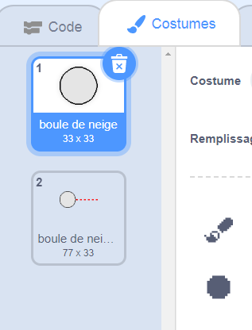
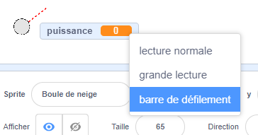
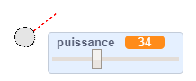

## Faire une boule de neige

Faisons une boule de neige, que tu peux lancer autour de ta scène.

--- task ---

Ouvre le projet de démarrage Scratch.

**En ligne** : ouvre le [projet de démarrage](http://rpf.io/snowball-fight-on){:target="_blank"}.

Si tu as un compte Scratch, tu peux en créer une copie en cliquant sur **Remix**.

**Hors-ligne** : ouvre le [projet de démarrage](http://rpf.io/p/en/snowball-fight-go){:target="_blank"} dans l'éditeur hors-ligne.

Si tu dois télécharger et installer l'éditeur hors-ligne Scratch, tu peux le trouver à [rpf.io/scratchoff](http://rpf.io/scratchoff){:target="_blank"}.

Dans le projet de démarrage, tu devrais voir une scène vide et un sprite de boule de neige.

--- /task ---

--- task ---

Le sprite « Boule de neige » contient 2 costumes, un costume normal et un qui montre dans quelle direction la boule de neige se dirige.



--- /task ---

--- task ---

Tout d'abord, laissons le joueur changer l'inclinaison de la boule de neige. Ajoute ce code à ton sprite de boule de neige :


```blocks3
when flag clicked
wait (0.5) seconds
go to x:(-200) y:(-130)
point in direction (90)
switch costume to (snowball-aim v)
repeat until <mouse down?>
    point towards (mouse-pointer v)
end
```

--- /task ---

--- task ---

Teste ton projet en cliquant sur le drapeau vert. Tu devrais voir que ta boule de neige suit la souris, jusqu'à ce que tu appuies sur le bouton de la souris.


--- /task ---

--- task ---

Permettons également au joueur de décider de la puissance de la boule de neige. Crée une nouvelle variable appelée `puissance`{:class="block3variables"}.

[[[generic-scratch3-add-variable]]]

--- /task ---

--- task ---

Fais glisser ta nouvelles variable d'affichage vers le bas de la scène, près de la boule de neige. Fais un clic droit sur l'affichage de la variable et clique sur « barre de défilement ».



--- /task ---

--- task ---

Ajoute du code pour définir ta nouvelle variable `puissance`{:class="block3variables"} à 0 quand le drapeau est cliqué.


```blocks3
when flag clicked
+ set [power v] to (0)
```

--- /task ---

--- task ---

Maintenant que tu as une variable `puissance`{:class="block3variables"}, tu peux augmenter la puissance de la boule de neige _après_ que la direction ait été choisie avec ce code :


```blocks3
repeat until <mouse down?>
    point towards (mouse-pointer v)
end
+repeat until < not <mouse down?> >
    point towards (mouse-pointer v)
    change [power v] by (1)
    wait (0.1) seconds
end
```

Ce code signifie que tu dois _garder le bouton de la souris enfoncé_ après avoir choisi la direction, pour choisir la puissance de la boule de neige.

--- /task ---

--- task ---

Teste ta boule de neige pour voir si tu peux choisir son inclinaison et sa puissance.



--- /task ---
