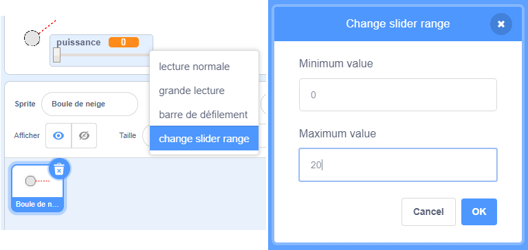

## Mouvement réaliste

Tu as maintenant une boule de neige, mais faisons en sorte qu'elle bouge de manière un peu plus réaliste.

--- task ---

Tout d'abord, définissons un niveau de puissance maximum, afin que la boule de neige ne puisse pas être lancée trop fortement.

Dans le code `quand le drapeau est cliqué`{:class="block3events"} de ta boule de neige, nous devons augmenter la puissance seulement si elle est inférieure à 20. Change ton code en :


```blocks3
repeat until< not <mouse down?> >
+   if < (power) < [20] > then
        change [power v] by (1)
        wait (0.1) seconds
    end
end
```

--- /task ---

--- task ---

Teste à nouveau ta boule de neige, et tu verras que la puissance ne dépasse jamais 20.

--- /task ---

--- task ---

Maintenant que la puissance maximale de ta boule de neige est de 20, tu peux la définir comme la valeur maximale du curseur de la variable. Fais un clic droit sur ta variable « puissance », puis clique sur « change slider range ».




--- /task ---

--- task ---

Tu peux également ralentir la boule de neige en réduisant légèrement la puissance en volant dans les airs. Ajoute ce bloc de code au code `quand je reçois [lancer]`{:class="block3events"} de ta boule de neige :


```blocks3
when I receive [throw v]
switch costume to (snowball v)
repeat until < touching [edge v]? >
    move (power) steps
+   change [power v] by (-0.25)
end
hide
```

--- /task ---


--- task ---

Teste ce nouveau code - fonctionne-t-il comme prévu ? Tu remarqueras peut-être que la puissance continue de diminuer, et que la boule de neige revient en arrière !

Pour corriger cela, tu peux ajouter un bloc `si`{:class="block3control"} à ton code, de sorte que la puissance ne soit réduite que si elle est supérieure à 0 :


```blocks3
when I receive [throw v]
switch costume to (snowball v)
repeat until < touching [edge v]? >
    move (power) steps
+   if < (power) > (0) > then
        change [power v] by (-0.25)
    end
end
hide
```

--- /task ---

--- task ---

Tu y es presque, mais tu dois aussi ajouter de la gravité à ta boule de neige, afin qu'elle tombe au sol. Tu peux ajouter de la gravité en déplaçant la boule de neige en continu avec ce code :


```blocks3
when I receive [throw v]
switch costume to (snowball v)
repeat until < touching [edge v]? >
+   change y by (-5)
    move (power) steps
    if < (power) > (0) > then
        change [power v] by (-0.25)
    end
end
hide
```

--- /task ---

--- task ---

Teste à nouveau ta boule de neige, et tu devrais voir que ta boule de neige se déplace de manière beaucoup plus réaliste.

--- /task ---

