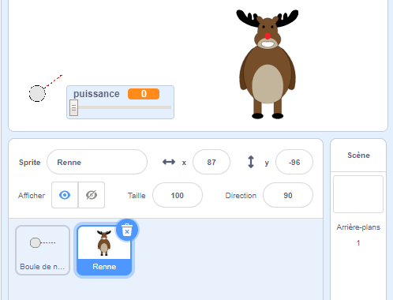
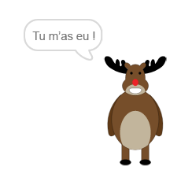
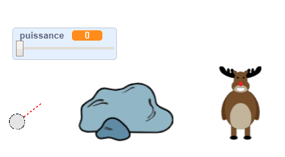
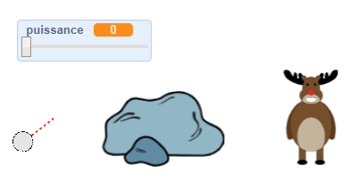

## La cible

Ajoutons une cible pour tes boules de neige !

--- task ---

Ajoute un autre sprite à ton projet.



[[[generic-scratch3-sprite-from-library]]]

--- /task ---

--- task ---

Ajoute ce code à ton nouveau sprite, pour qu'il dise « Tu m'as eu ! » quand il sera touché :


```blocks3
when flag clicked
forever
    if < touching [snowball v]? > then
        say [You got me!] for (1) seconds
    end
end
```

--- /task ---

--- task ---

Teste ton nouveau code.



--- /task ---

--- task ---

Faisons plusieurs choses pour rendre le jeu plus difficile. Tout d'abord, déplaçons le renne chaque fois que le joueur lance la boule de neige.

Pour cela, ajoute d'abord un `envoyer à tous`{:class="block3control"} à ta boule de neige, près du haut de ta boucle `répéter indéfiniment`{:class="block3control"}. Cela fera savoir à ton renne qu'un nouveau tir est sur le point d'être fait.


```blocks3
when flag clicked
forever
set [power v] to (0)
+broadcast (new shot v)
wait (0.5) seconds
go to x:(-200) y:(-130)
point in direction (90)
switch costume to (snowball-aim v)
show
repeat until <mouse down?>
    point towards (mouse-pointer v)
end
repeat until < not <mouse down?> >
    point towards (mouse-pointer v)
    change [power v] by (1)
    wait (0.1) seconds
end
broadcast (throw v) and wait
end
```

Lorsque ton renne reçoit ce message, déplace-le à une nouvelle position aléatoire avec ce code :


```blocks3
when I receive [new shot v]
set x to (pick random (0) to (200))
```

--- /task ---

--- task ---

Teste ton projet en lançant quelques boules de neige. Est-ce que la position de ta cible se déplace à chaque fois ?

--- /task ---

--- task ---

Tu peux également rendre ton jeu plus difficile en ajoutant un rocher devant ta boule de neige.



--- /task ---

--- task ---

Tu peux maintenant changer le code de ta boule de neige, pour qu'elle s'arrête quand elle touche le bord de l'écran _ou_ quand elle touche le rocher.


```blocks3
when I receive [throw v]
switch costume to (snowball v)
+ repeat until << touching [edge v]? > or <touching [Rocks v]?>>
    change y by (-5)
    move (power) steps
    if <(power) > [0]> then
    change [power v] by (-0.25)
    end
end
hide
```

--- /task ---

--- task ---

Enfin, tu peux rendre ton jeu plus difficile en rétrécissant ta boule de neige et ton renne.



--- /task ---
