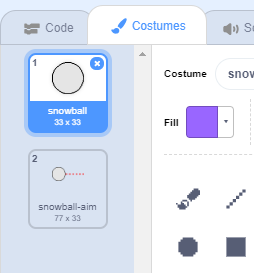

## बर्फ़गोले बनाना

चलिए बर्फ़गोले बनाते है ताकि हम उसे स्टेज (stage) के आस पास फ़ेंक सकें |

--- task ---

Scratch स्टार्टर प्रोजेक्ट खोलें।

**Online**: open the [starter project](https://rpf.io/snowball-fight-on){:target="_blank"}.

यदि आपके पास एक Scratch खाता (account) है तो आप **Remix** पर क्लिक करके प्रतिलिपि बना सकते हैं |

**Offline**: open the [starter project](https://rpf.io/p/en/snowball-fight-go){:target="_blank"} in the offline editor.

If you need to download and install the Scratch offline editor, you can find it at [rpf.io/scratchoff](https://rpf.io/scratchoff){:target="_blank"}.

स्टार्टर प्रोजेक्ट में आपको एक खाली स्टेज और बर्फ़गोला स्प्राइट (snowball sprite) दिखना चाहिए।

--- /task ---

--- task ---

'बर्फ़गोला' स्प्राइट के 2 पोशाक (costumes) है| एक सामान्य पोशाक है और एक है जिसमें दिखाया गया है कि बर्फ़गोला किस दिशा में जाएगा।



--- /task ---

--- task ---

सबसे पहले आइए खिलाड़ी को बर्फ़गोला के कोण (angle) को बदलने की अनुमति दें। इस कोड को अपने बर्फ़गोला स्प्राइट में जोड़ें:


```blocks3
when flag clicked
wait (0.5) seconds
go to x:(-200) y:(-130)
point in direction (90)
switch costume to (snowball-aim v)
repeat until <mouse down?>
    point towards (mouse-pointer v)
end
```

--- /task ---

--- task ---

हरे झंडे पर क्लिक करके अपने प्रोजेक्ट का परीक्षण करें। आपको ये दिखेगा कि आपका बर्फ़गोला माउस के दिशा में पीछे पीछे जाता रहेगा जब तक आप माउस का बटन न दबा दें।


--- /task ---

--- task ---

आइए खिलाड़ी को यह तय करने की भी अनुमति दें कि बर्फ़गोला को कितनी ताकत से फेंकना चाहिए। `power`{:class="block3variables"} नामक वेरिएबल (variable) बनाएँ।

[[[generic-scratch3-add-variable]]]

--- /task ---

--- task ---

अपने नए वैरिएबल को स्टेज के नीचे बर्फ़गोले के पास खींच कर ले जाएं | स्टेज पर वेरिएबल प्रदर्शक(display) पर राइट क्लिक करें और 'slider' पर क्लिक करें।


--- /task ---

--- task ---

हरे झंडे को क्लिक करने पर अपने नए `power`{:class="block3variables"} वेरिएबल को 0 पर सेट करने के लिए कोड जोड़ें।


```blocks3
when flag clicked
+ set [power v] to (0)
```

--- /task ---

--- task ---

अब आपके पास `power` {"class =" block3variables "} वेरिएबल है, अब आप बर्फ़गोले की शक्ति बढ़ा सकते हैं लेकिन सिर्फ़ नीचे दिए गए कोड से दिशा चुनने के _बाद_ ही:


```blocks3
repeat until <mouse down?>
    point towards (mouse-pointer v)
end
+repeat until < not <mouse down?> >
    point towards (mouse-pointer v)
    change [power v] by (1)
    wait (0.1) seconds
end
```

इस कोड का मतलब है कि आपको बर्फ के गोले की शक्ति को चुनने के लिए दिशा चुनने के बाद _माउस बटन को दबाकर रखना होगा_।

--- /task ---

--- task ---

अपने बर्फ़गोले का परीक्षण करें यह देखने के लिए कि क्या आप इसके कोण (angle) और शक्ति (power) को चुन पाते है |


--- /task ---
