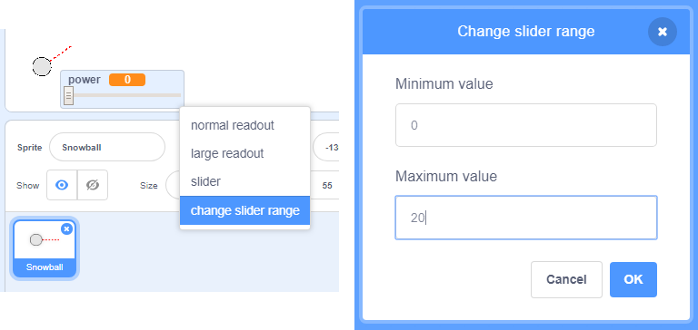

## वास्तविक संचलन

अब आपके पास एक बर्फ़गोला है लेकिन चलिए इसे थोड़ा और वास्तविक रूप से आगे बढ़ाएं।

--- task ---

सबसे पहले हम इसका अधिकतम शक्ति स्तर (maximum power level) सेट करें ताकि बर्फ़गोले को बहुत तेज़ से फेंका न जा सके।

आपके बर्फ़गोले के `when flag clicked`{:class="block3events"} कोड में हमें केवल 20 से कम होने पर शक्ति बढ़ाने की आवश्यकता है। अपना कोड बदलें:


```blocks3
repeat until< not <mouse down?> >
+   if < (power) < [20] > then
        change [power v] by (1)
        wait (0.1) seconds
    end
end
```

--- /task ---

--- task ---

अपने बर्फ़गोले का फिर से परीक्षण करें और आप देखेंगे कि शक्ति (power) कभी भी 20 से ऊपर नहीं जाता है।

--- /task ---

--- task ---

अब जब आपकी बर्फ़गोले की अधिकतम शक्ति 20 है तो आप इसे वेरिएबल के स्लाइडर में भी अधिकतम मूल्य के रूप में सेट कर सकते हैं। अपने शक्ति (power) वेरिएबल पर राइट-क्लिक करें और 'set slider min and max' पर क्लिक करें।




--- /task ---

--- task ---

आप बर्फ़गोले को धीमा भी कर सकते हैं| Power (शक्ति) को थोड़ा कम करके जब बर्फ का गोला हवा में उड़ता है। इस कोड को अपने बर्फ़गोले `when I receive [throw]`{:class="block3events"} के कोड में जोड़ें:


```blocks3
when I receive [throw v]
switch costume to (snowball v)
repeat until < touching [edge v]? >
    move (power) steps
+   change [power v] by (-0.25)
end
hide
```

--- /task ---


--- task ---

इस नए कोड का परीक्षण करें - क्या यह आपकी अपेक्षा के अनुरूप काम करता है? आप देख सकते हैं कि Power (शक्ति) कम हो रही है और इसके नतीजे बर्फ का गोला पीछे की ओर बढ़ने लगता है!

To fix this, you can add an `if`{:class="block3control"} block to your code, so that the power is only lowered if it is above 0:


```blocks3
when I receive [throw v]
switch costume to (snowball v)
repeat until < touching [edge v]? >
    move (power) steps
+   if < (power) > (0) > then
        change [power v] by (-0.25)
    end
end
hide
```

--- /task ---

--- task ---

You're nearly there, but you also need to add some gravity to your snowball, so that it falls to the ground. You can add gravity by just moving the snowball down continuously with this code:


```blocks3
when I receive [throw v]
switch costume to (snowball v)
repeat until < touching [edge v]? >
+   change y by (-5)
    move (power) steps
    if < (power) > (0) > then
        change [power v] by (-0.25)
    end
end
hide
```

--- /task ---

--- task ---

Test out your snowball again, and you should see that your snowball moves much more realistically.

--- /task ---

