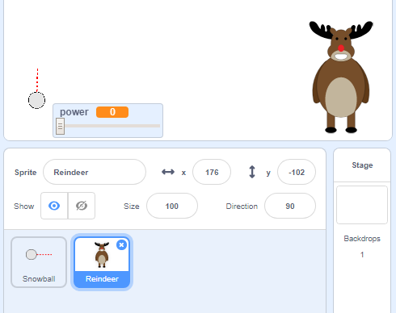
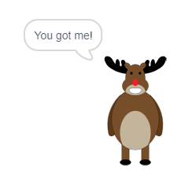
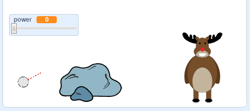

## लक्ष्य

चलिए आपके बर्फगोलो के लिए एक लक्ष्य जोड़ा जाये!

--- task ---

अपने प्रोजेक्ट में एक और स्प्राइट जोड़ें।



[[[generic-scratch3-sprite-from-library]]]

--- /task ---

--- task ---

इस कोड को अपने नए स्प्राइट में जोड़ें ताकि यह कहे कि "You got me!" जब बर्फ़गोला सफलता पूर्वक उसे मार पाए:


```blocks3
when flag clicked
forever
    if < touching [snowball v]? > then
        say [You got me!] for (1) seconds
    end
end
```

--- /task ---

--- task ---

अपने नए कोड का परीक्षण करें।



--- /task ---

--- task ---

चलिए कुछ और चीज़ें करते है ताकि गेम और कठिन हो जाये | सबसे पहले हर बार जब खिलाड़ी बर्फ का गोला फेंकता है, तो बारासिंघा को हिलाते हैं।

ऐसा करने के लिए पहले `broadcast`{:class="block3control"} को अपने बर्फ़गोले में जोड़ें जो आपके `forever`{:class="block3control"} लूप के ऊपर होगा | यह आपके बारासिंघा को यह बता देगा कि एक नया शॉट(shot) लिया जाने वाला है।


```blocks3
when flag clicked
forever
set [power v] to (0)
+broadcast (new shot v)
wait (0.5) seconds
go to x:(-200) y:(-130)
point in direction (90)
switch costume to (snowball-aim v)
show
repeat until <mouse down?>
    point towards (mouse-pointer v)
end
repeat until < not <mouse down?> >
    point towards (mouse-pointer v)
    change [power v] by (1)
    wait (0.1) seconds
end
broadcast (throw v) and wait
end
```

जब आपका बारासिंघा को यह संदेश मिलता है तो उसे इस कोड के साथ एक नई यादृच्छिक (random) जगह में ले जाएं:


```blocks3
when I receive [new shot v]
set x to (pick random (0) to (200))
```

--- /task ---

--- task ---

कुछ बर्फ़गोले फेंककर अपनी प्रोजेक्ट का परीक्षण करें। क्या आपका लक्ष्य हर बार जगह बदलता है?

--- /task ---

--- task ---

आप अपने बर्फ़गोले के सामने एक चट्टान जोड़कर अपने खेल को कठिन बना सकते हैं।



--- /task ---

--- task ---

अब आप अपने बर्फ़गोले का कोड बदल सकते हैं ताकि वो रुक जाये जब वह स्क्रीन (screen) के किनारे को छूता है _या_ जब यह चट्टान को छूता है।


```blocks3
when I receive [throw v]
switch costume to (snowball v)
+ repeat until << touching [edge v]? > or <touching [Rocks v]?>>
    change y by (-5)
    move (power) steps
    if <(power) > [0]> then
    change [power v] by (-0.25)
    end
end
hide
```

--- /task ---

--- task ---

अंत में आप अपने बर्फ़गोले और अपने बारासिंघा को छोटा बनाकर अपने खेल को और कठिन बना सकते हैं।


--- /task ---
