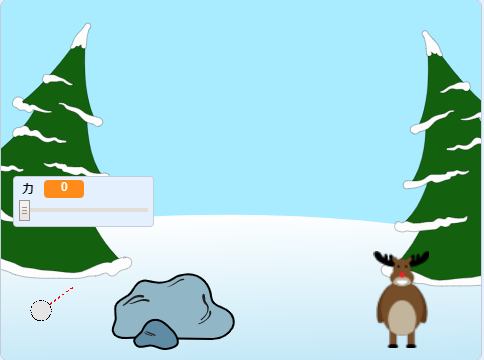

--- no-print ---

これはプロジェクトの **Scratch 3**バージョンです。 [Scratch 2バージョンのプロジェクト](https://projects.raspberrypi.org/en/projects/snowball-fight-scratch2)もあります。

--- /no-print ---

## はじめに

このプロジェクトでは、まとに雪玉を当てるゲームを作ります。

### 作るもの

--- no-print ---

マウスポインタを使って雪玉の角度を調整（ちょうせい）し、マウスボタンを押して (おして) 雪玉を投げる力を決めます。

  <iframe allowtransparency="true" width="485" height="402" src="https://scratch.mit.edu/projects/embed/302159331/?autostart=true" frameborder="0" scrolling="no"></iframe>
  

--- /no-print ---

--- print-only ---

--- /print-only ---

--- collapse ---
---
title: 必要 (ひつよう) なもの
---

### ハードウェア

+ Scratch を実行できるコンピュータ

### ソフトウェア

+ Scratch 3 (either [online](https://rpf.io/scratchon){:target="_blank"} or [offline](https://rpf.io/scratchoff){:target="_blank"})

### ダウンロード

The starter project can be found [here](https://rpf.io/p/en/snowball-fight-go){:target="_blank"}.

--- /collapse ---

--- collapse ---
---
title: 学ぶこと
---

- スプライトの動かし方
- マウスの入力に反応させる方法
- メッセージの使い方

--- /collapse ---

--- collapse ---
---
title: 指導者向けの追加情報
---

--- no-print ---

このプロジェクトを印刷する必要がある場合は、 [印刷用バージョン](https://projects.raspberrypi.org/en/projects/snowball-fight/print){:target="_ blank"}を使用してください。

--- /no-print ---

You can find the [completed project here](https://rpf.io/p/en/snowball-fight-get){:target="_blank"}.

--- /collapse ---
