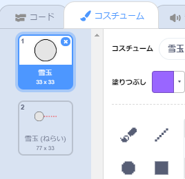
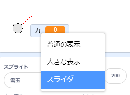
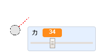

## 雪玉を作る

ステージ上で投げる雪玉を作ってみましょう。

--- task ---

基本（きほん）のScratchプロジェクトを開きます。

**Online**: open the [starter project](https://rpf.io/snowball-fight-on){:target="_blank"}.

Scratch アカウントを持っている場合は、 **リミックス**ボタンをクリックしてプロジェクトをコピーできます。

**Offline**: open the [starter project](https://rpf.io/p/en/snowball-fight-go){:target="_blank"} in the offline editor.

If you need to download and install the Scratch offline editor, you can find it at [rpf.io/scratchoff](https://rpf.io/scratchoff){:target="_blank"}.

基本のプロジェクトには、何もないステージと雪玉のスプライトがあります。

--- /task ---

--- task ---

「雪玉」のスプライトには2つのコスチュームがあります。ふつうのコスチュームと、雪玉の向きをしめすコスチュームです。



--- /task ---

--- task ---

まず、プレーヤーが雪玉の角度をかえられるようにしましょう。 このコードを雪玉のスプライトに追加 (ついか) します。


```blocks3
when flag clicked
wait (0.5) seconds
go to x:(-200) y:(-130)
point in direction (90)
switch costume to (snowball-aim v)
repeat until <mouse down?>
    point towards (mouse-pointer v)
end
```

--- /task ---

--- task ---

緑の旗 (はた) をクリックしてプロジェクトをテストしましょう。 マウスボタンを押すまで、雪玉がマウスについてくることがわかります。


--- /task ---

--- task ---

プレーヤーが雪玉を投げる力を決められるようにしましょう。 `力`{:class="block3variables"}という新しい変数 (へんすう) を作成 (さくせい) します。

[[[generic-scratch3-add-variable]]]

--- /task ---

--- task ---

新しい変数の表示 (ひょうじ) を、雪玉の近くのステージの下部にドラッグします。 変数の表示を右クリックし、「スライダー」をクリックします。



--- /task ---

--- task ---

旗が押されたときに、`力`{:class="block3variables"}変数を0に設定 (せってい) するコードを追加します。


```blocks3
when flag clicked
+ set [power v] to (0)
```

--- /task ---

--- task ---

これで`力`{:class="block3variables"} 変数ができたので、方向を_決めたあとで_、このコードを使って雪玉を投げる力を強くすることができます。


```blocks3
repeat until <mouse down?>
    point towards (mouse-pointer v)
end
+repeat until < not <mouse down?> >
    point towards (mouse-pointer v)
    change [power v] by (1)
    wait (0.1) seconds
end
```

このコードは、雪玉を投げる力を決めるには、方向を決めたあとに_マウスボタンを押したまま_にしておく必要があることを意味します。

--- /task ---

--- task ---

雪玉をテストして、角度と投げる力をえらべるかどうかをたしかめます。



--- /task ---
