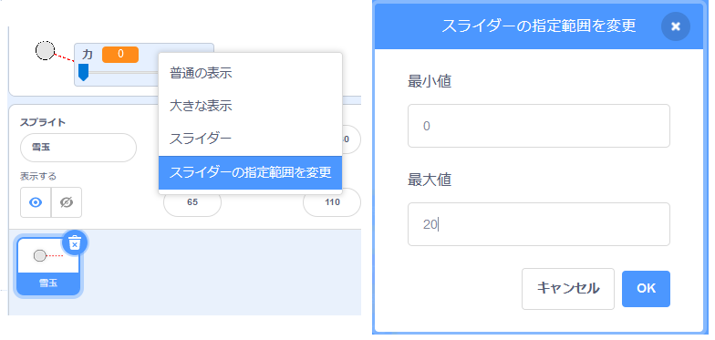

## リアルな動き

これで雪玉ができましたが、もう少し動きをリアルにしてみましょう。

--- task ---

まず、雪玉があまりに強く投げられないように、力の上限 (じょうげん) を設定しましょう。

雪玉の`旗が押されたとき`{:class="block3events"}のコードでは、力が20より下の場合のときにのみ、力を上げる必要があります。 コードを次のようにかえます。


```blocks3
repeat until< not <mouse down?> >
+   if < (力) < [20] > then
        change [力 v] by (1)
        wait (0.1) seconds
    end
end
```

--- /task ---

--- task ---

もう一度雪玉をテストしてみると、力が20をこえないことがわかります。

--- /task ---

--- task ---

雪玉を投げる力の上限が20になったので、これを変数のスライダーの最大値 (さいだいち) としても設定できます。 力変数を右クリックし、「スライダーの指定範囲 (していはんい) を変更 (へんこう) 」をクリックします。




--- /task ---

--- task ---

また、雪玉が空中をとんでいるときに力を下げることで、雪玉の速度を下げることもできます。 `[投げる]を受け取ったとき`{:class="block3events"}のコードにこのコードブロックを追加します。


```blocks3
when I receive [投げる v]
switch costume to (雪玉 v)
repeat until < touching [edge v]? >
    move (力) steps
+   change [力 v] by (-0.25)
end
hide
```

--- /task ---


--- task ---

新しいコードをテストしましょう。コードは思った通りに動きますか？ 力が下がりつづけて、最後には雪玉がぎゃくの方向に動いてしまうことに気づいたかも知れませんね。

`もし`{:class="block3control"}ブロックをコードに追加すると、力が0より上のときにのみ、力が下がるようになります。


```blocks3
when I receive [投げる v]
switch costume to (雪玉 v)
repeat until < touching [edge v]? >
    move (力) steps
+   if < (力) > (0) > then
        change [力 v] by (-0.25)
    end
end
hide
```

--- /task ---

--- task ---

もうすぐプロジェクトが仕上がりますが、その前に雪玉が地面に落ちるように、雪玉に重力を加える必要があります。 このコードを使って、雪玉を下に移動させつづけることで重力を加えることができます。


```blocks3
when I receive [投げる v]
switch costume to (雪玉 v)
repeat until < touching [edge v]? >
+   change y by (-5)
    move (力) steps
    if < (力) > (0) > then
        change [力 v] by (-0.25)
    end
end
hide
```

--- /task ---

--- task ---

雪玉をもう一度テストしてみましょう。雪玉がよりリアルに動くことが分かるはずです。

--- /task ---

