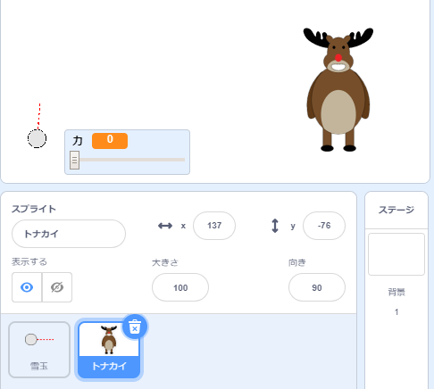
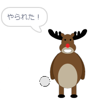
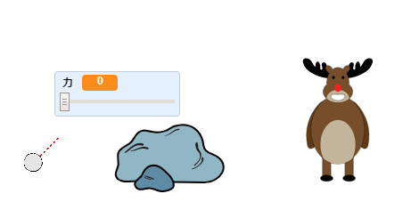
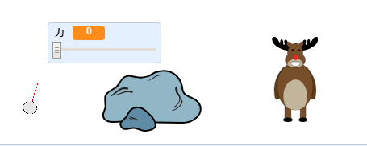

## まと

雪玉を当てるまとを作りましょう！

--- task ---

プロジェクトにべつのスプライトを追加します。



[[[generic-scratch3-sprite-from-library]]]

--- /task ---

--- task ---

このコードを新しいスプライトに追加して、雪玉が当たったときに「やられた！」と言うようにします。


```blocks3
when flag clicked
forever
    if < touching [snowball v]? > then
        say [You got me!] for (1) seconds
    end
end
```

--- /task ---

--- task ---

コードをテストしましょう。



--- /task ---

--- task ---

ゲームをむずかしくしてみましょう。 まず、プレーヤーが雪玉を投げるたびにトナカイが動くようにします。

こうするには、雪玉の`ずっと`{:class="block3control"}ループの上部に`新しいメッセージ`{:class="block3control"}を追加します。 こうすることで、トナカイはプレーヤーが新しい雪玉を投げることを知ります。


```blocks3
when flag clicked
forever
set [power v] to (0)
+broadcast (new shot v)
wait (0.5) seconds
go to x:(-200) y:(-130)
point in direction (90)
switch costume to (snowball-aim v)
show
repeat until <mouse down?>
    point towards (mouse-pointer v)
end
repeat until < not <mouse down?> >
    point towards (mouse-pointer v)
    change [power v] by (1)
    wait (0.1) seconds
end
broadcast (throw v) and wait
end
```

このメッセージを受け取ったとき、トナカイはこのコードを使ってランダムな位置 (いち) に移動します。


```blocks3
when I receive [new shot v]
set x to (pick random (0) to (200))
```

--- /task ---

--- task ---

雪玉を数回投げて、プロジェクトをテストしましょう。 まとは毎回位置を移動していますか？

--- /task ---

--- task ---

雪玉の前に岩を追加することで、ゲームをむずかしくすることもできます。



--- /task ---

--- task ---

コードをかえて、雪玉がスクリーンの端_または_岩に触れると止まるようにします。


```blocks3
when I receive [throw v]
switch costume to (snowball v)
+ repeat until << touching [edge v]? > or <touching [Rocks v]?>>
    change y by (-5)
    move (power) steps
    if <(power) > [0]> then
    change [power v] by (-0.25)
    end
end
hide
```

--- /task ---

--- task ---

最後に、雪玉とトナカイを小さくすることでゲームがむずかしくなります。



--- /task ---
