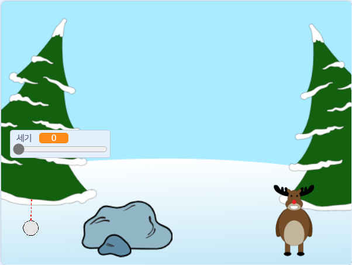

--- no-print ---

이 프로젝트에 사용된 버전은 **스크래치 3** 입니다. [스크래치 2](https://projects.raspberrypi.org/en/projects/snowball-fight-scratch2) 버전으로 진행되는 프로젝트도 있습니다.

--- /no-print ---

## 소개

이 프로젝트에서는 눈덩이를 목표물에 던져야 하는 게임을 만들 것입니다.

### 만들 작품

--- no-print ---

마우스 포인터를 사용해 눈덩이를 던지는 각도를 조절하고 마우스를 꾹 클릭하여 눈덩이를 던지는 강도를 조절하세요.

  <iframe allowtransparency="true" width="485" height="402" src="https://scratch.mit.edu/projects/embed/302159331/?autostart=true" frameborder="0" scrolling="no"></iframe>
  

--- /no-print ---

--- print-only ---

--- /print-only ---

--- collapse ---
---
title: 준비물
---

### 하드웨어

+ 스크래치를 실행할 수 있는 컴퓨터

### 소프트웨어

+ 스크래치 3 ([온라인](http://rpf.io/scratchon){:target="_blank"} 또는 [오프라인](http://rpf.io/scratchoff){:target="_blank"})

### 다운로드

스타터 프로젝트는 [여기](http://rpf.io/p/en/snowball-fight-go){:target="_blank"}를 클릭하면 열 수 있습니다.

--- /collapse ---

--- collapse ---
---
title: 배울 내용
---

- 스프라이트를 움직이는 방법
- 마우스 입력에 반응하는 방법
- 방송 사용법

--- /collapse ---

--- collapse ---
---
title: 교육자를 위한 추가 정보
---

--- no-print ---

이 프로젝트를 인쇄하기 위해서는 [프린트용 버전](https://projects.raspberrypi.org/en/projects/snowball-fight/print){:target="_blank"}을 사용해 주십시오.

--- /no-print ---

완성된 프로젝트는 [여기](http://rpf.io/p/en/snowball-fight-get){:target="_ blank"}에서 확인할 수 있습니다.

--- /collapse ---
