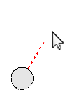

## 눈덩이 만들기

스테이지 주변에 던질 수 있는 눈덩이를 만들어봅시다.

--- task ---

스크래치 스타터 프로젝트를 엽니다.

**온라인**: [스타터 프로젝트](https://scratch.mit.edu/projects/399474195){:target="_blank"}을 엽니다.

스크래치 계정이 있는 경우 **리믹스**를 클릭하여 복사본을 만들 수 있습니다.

**오프라인**: [스타터 프로젝트](https://rpf.io/p/ko-KR/snowball-fight-go){:target="_blank"} 를 오프라인 에디터에서 여세요.

스크래치 오프라인 에디터를 다운로드 받아야 하는 경우, [rpf.io/scratchoff](https://rpf.io/scratchoff){:target="_blank"} 에서 다운로드 받을 수 있습니다.

스타터 프로젝트에서 빈 배경과 눈덩이 스프라이트를 확인할 수 있을 것입니다.

--- /task ---

--- task ---

'눈덩이' 스프라이트는 기본 모양과 궤적을 보여주는 모양, 총 2가지의 모양을 포함하고 있습니다.


--- /task ---

--- task ---

먼저 플레이어가 눈덩이의 각도를 조절할 수 있도록 합시다. 이 코드를 눈덩이 스프라이트에 추가해 보세요:


```blocks3
when flag clicked
wait (0.5) seconds
go to x:(-200) y:(-130)
point in direction (90)
switch costume to (눈덩이 궤적 v)
repeat until <mouse down?>
    point towards (mouse-pointer v)
end
```

--- /task ---

--- task ---

녹색 깃발을 클릭하여 프로젝트를 테스트 해보세요. 마우스를 클릭하기 전까지 눈덩이가 마우스 커서를 따라다니는 것을 볼 수 있습니다.



--- /task ---

--- task ---

플레이어가 눈덩이를 얼마나 세게 던질지 결정할 수 있게 합시다. `세기`{:class="block3variables"}라는 이름의 새로운 변수를 추가해보세요.

[[[generic-scratch3-add-variable]]]

--- /task ---

--- task ---

새 변수 표시창을 배경 하단, 눈덩이 근처로 드래그하세요. 스테이지 위의 변수 표시창을 우클릭 해서 '슬라이더 사용하기'를 눌러 보세요.


--- /task ---

--- task ---

깃발을 클릭하면 새로운 `세기`{:class="block3variables"} 변수가 0으로 설정되게 코드를 추가하세요.


```blocks3
when flag clicked
+ set [세기 v] to (0)
```

--- /task ---

--- task ---

이제 `세기`{:class="block3variables"} 변수가 생겼으므로 _눈덩이를 던질 방향을 정한 다음_ 눈덩이를 던지는 세기를 늘릴 수 있습니다.


```blocks3
repeat until <mouse down?>
    point towards (mouse-pointer v)
end
+repeat until < not <mouse down?> >
    point towards (mouse-pointer v)
    change [세기 v] by (1)
    wait (0.1) seconds
end
```

이 코드는 눈덩이의 각도를 조절한 후 눈덩이의 세기를 조절하기 위해서 _마우스 버튼을 꾹 누르고 있어야 한다_는 내용입니다.

--- /task ---

--- task ---

눈덩이를 테스트하기 위해서 각도와 세기를 조절할 수 있는지 확인해보세요.


--- /task ---
