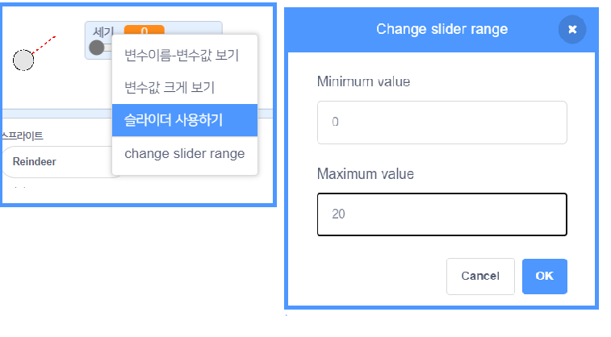

## 사실적인 움직임

이제 눈덩이가 생겼지만 좀 더 현실적으로 움직이도록 해봅시다.

--- task ---

먼저 눈덩이가 너무 세게 던져지지 않도록 최대 세기를 설정합시다.

`깃발을 클릭했을 때`{:class="block3events"} 코드에서 우리는 세기가 20보다 작을 때만 세기를 증가시켜야합니다. 코드를 다음과 같이 변경하세요:


```blocks3
repeat until< not <mouse down?> >
+   if < (세기) < [20] > then
        change [세기 v] by (1)
        wait (0.1) seconds
    end
end
```

--- /task ---

--- task ---

눈덩이를 다시 테스트해보면, 세기가 20을 넘지 않는 것을 볼 수 있습니다.

--- /task ---

--- task ---

이제 눈덩이의 최고 세기가 20이므로, 변수 슬라이더의 최댓값도 20으로 설정해봅시다. 세기 변수를 우클릭하고 'change slider range'를 클릭하세요.




--- /task ---

--- task ---

눈덩이가 날아가고 있을 때 세기를 조금씩 줄임으로써 눈덩이가 점점 천천히 날아가게 할 수 있습니다. 이 코드 블럭을 `[던지기] 신호를 받았을 때`{:class="block3events"} 코드에 추가하세요.


```blocks3
when I receive [던지기 v]
switch costume to (눈덩이 v)
repeat until < touching [edge v]? >
    move (세기) steps
+   change [세기 v] by (-0.25)
end
hide
```

--- /task ---


--- task ---

새 코드를 테스트해보세요. 예상대로 잘 작동하나요? 세기가 점점 줄어들어 결국 눈덩이가 뒤로 움직이는 것을 볼 수 있을 것입니다.

이 문제를 해결하려면, `만약 ~이라면`{:class="block3control"} 블럭을 추가해 세기가 0 이상일 경우에만 세기를 줄이도록 설정하세요.


```blocks3
when I receive [던지기 v]
switch costume to (눈덩이 v)
repeat until < touching [edge v]? >
    move (세기) steps
+   if < (세기) > (0) > then
        change [세기 v] by (-0.25)
    end
end
hide
```

--- /task ---

--- task ---

거의 다 왔습니다. 하지만 이번에는 눈덩이에 중력을 더해서 땅에 떨어지게 해야 합니다. 이 코드로 눈덩이가 계속 아래로 움직이게 해서 중력을 추가할 수 있습니다.


```blocks3
when I receive [던지기 v]
switch costume to (눈덩이 v)
repeat until < touching [edge v]? >
+   change y by (-5)
    move (세기) steps
    if < (세기) > (0) > then
        change [세기 v] by (-0.25)
    end
end
hide
```

--- /task ---

--- task ---

눈덩이를 다시 테스트해보면 눈덩이가 좀 더 실제같이 움직이는 것을 볼 수 있습니다.

--- /task ---

