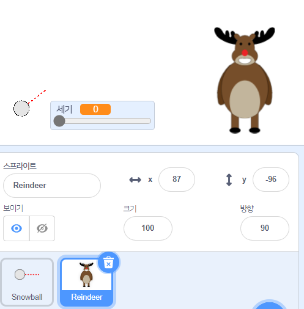
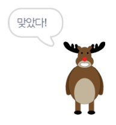
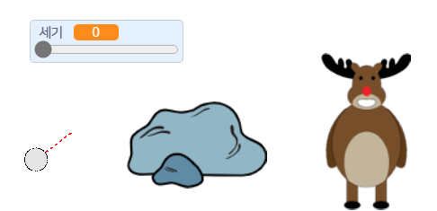
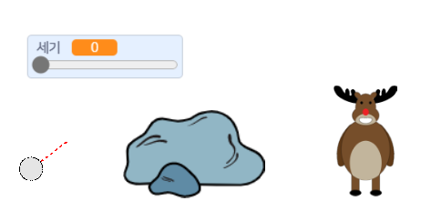

## 목표물

눈덩이의 목표물을 추가합시다!

--- task ---

프로젝트에 다른 스프라이트를 추가하세요.



[[[generic-scratch3-sprite-from-library]]]

--- /task ---

--- task ---

이 코드를 새로운 스프라이트에 추가해 눈덩이와 부딪힐 때 '맞았다!'라고 말하도록 하세요:


```blocks3
when flag clicked
forever
    if < touching [눈덩이 v]? > then
        say [맞혔다!] for (1) seconds
    end
end
```

--- /task ---

--- task ---

새 코드를 테스트해보세요.



--- /task ---

--- task ---

게임을 더 어렵게 만들기 위해 몇 가지 작업을 해 봅시다. 먼저 플레이어가 눈덩이를 던질 때마다 순록이 움직이도록 합시다.

이렇게 하려면, 먼저 `방송하기`{:class="block3control"} 블럭을 눈덩이의 `반복하기`{:class="block3control"} 블럭 윗쪽에 추가하세요. 이렇게 하면 순록에게 새로운 눈덩이가 던져질 것이라는 것을 알려줄 수 있습니다.


```blocks3
when flag clicked
forever
set [세기 v] to (0)
+broadcast (새로운 눈덩이 v)
wait (0.5) seconds
go to x:(-200) y:(-130)
point in direction (90)
switch costume to (눈덩이 궤적 v)
show
repeat until <mouse down?>
    point towards (mouse-pointer v)
end
repeat until < not <mouse down?> >
    point towards (mouse-pointer v)
    change [세기 v] by (1)
    wait (0.1) seconds
end
broadcast (던지기 v) and wait
end
```

순록이 이 메시지를 받으면 이 코드로 랜덤한 위치로 움직이도록 하세요.


```blocks3
when I receive [새로운 눈덩이 v]
set x to (pick random (0) to (200))
```

--- /task ---

--- task ---

눈덩이를 몇 번 던져 테스트해보세요. 매번 목표물의 위치가 바뀌나요?

--- /task ---

--- task ---

눈덩이 앞에 바위를 추가해서 게임을 더 어렵게 만들 수도 있습니다.



--- /task ---

--- task ---

눈덩이의 코드를 수정해서 화면 가장자리 _또는_ 바위에 부딪히면 멈추게 하세요.


```blocks3
when I receive [던지기 v]
switch costume to (눈덩이 v)
+ repeat until << touching [edge v]? > or <touching [바위 v]?>>
    change y by (-5)
    move (세기) steps
    if <(세기) > [0]> then
    change [세기 v] by (-0.25)
    end
end
hide
```

--- /task ---

--- task ---

마지막으로 눈덩이와 순록의 크기를 줄여서 게임을 어렵게 만들어 보세요.



--- /task ---
