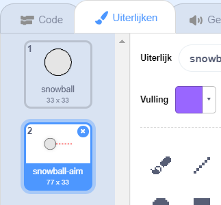
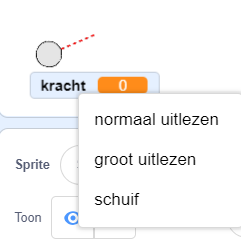
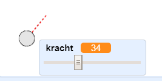

## Een sneeuwbal maken

Laten we een sneeuwbal maken, die je rond kunt gooien.

--- task ---

Open het Scratch startproject.

**Online**: open het [startproject](https://scratch.mit.edu/projects/389759977){:target="_blank"}.

Als je een Scratch-account hebt, kun je een kopie maken door op **Remix** te klikken.

**Offline**: open het [startproject](http://rpf.io/p/nl-NL/snowball-fight-go){:target="_blank"} in de offline editor.

Als je de Scratch offline editor wilt downloaden en installeren dan kun je die vinden op [rpf.io/scratchoff](http://rpf.io/scratchoff){:target="_blank"}.

In het startproject zou je een leeg podium en een sneeuwbal sprite moeten zien.

--- /task ---

--- task ---

De sprite 'Snowball' bevat 2 uiterlijken, een normaal uiterlijk en een uiterlijk dat aangeeft in welke richting de sneeuwbal kijkt.



--- /task ---

--- task ---

Laten we eerst zorgen dat de speler de hoek van de sneeuwbal kan veranderen. Voeg deze code toe aan je sneeuwbal sprite:


```blocks3
when green flag clicked
wacht (0.5) sec.
ga naar x:(-200) y:(-130)
richt naar (90) graden
verander uiterlijk naar (snowball-aim v)
herhaal tot <muis ingedrukt?>
    richt naar (muisaanwijzer v)
einde
```

--- /task ---

--- task ---

Test je project door op de groene vlag te klikken. Je zou moeten zien dat je sneeuwbal de muis volgt, totdat je op de muisknop klikt.


--- /task ---

--- task ---

Laten we de speler ook laten beslissen hoe hard de sneeuwbal moet worden gegooid. Maak een nieuwe variabele met de naam `kracht`{:class="block3variables"}.

[[[generic-scratch3-add-variable]]]

--- /task ---

--- task ---

Sleep je nieuwe variabele naar de onderkant van het speelveld, in de buurt van de sneeuwbal. Klik met de rechtermuisknop op de variabele weergave en klik op 'schuif'.



--- /task ---

--- task ---

Voeg code toe om je nieuwe `kracht`{:class="block3variables"} variabele in te stellen op 0 wanneer op de vlag wordt geklikt.


```blocks3
when green flag clicked
+ maak [kracht v] (0)
```

--- /task ---

--- task ---

Nu je een `kracht`{:class="block3variables"} variabele hebt, kun je de kracht van de sneeuwbal verhogen _nadat_ de richting is gekozen met deze code:


```blocks3
repeat until <muis ingedrukt?>
	point towards (muisaanwijzer v)
end
+repeat until < not <muis ingedrukt?> >
	point towards (muisaanwijzer v)
	change [kracht v] by (1)
	wait (0.1) seconds
end
```

Deze code betekent dat je _de muisknop ingedrukt moet houden_ na het kiezen van de richting, om de kracht van de sneeuwbal te kiezen.

--- /task ---

--- task ---

Test je sneeuwbal om te zien of je de hoek en kracht kunt kiezen.



--- /task ---
