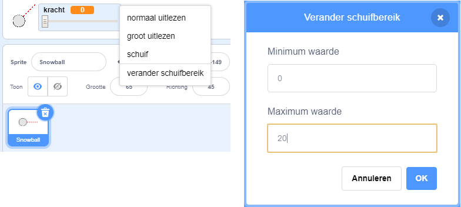

## Realistische beweging

Je hebt nu een sneeuwbal, maar laten we deze wat realistischer laten bewegen.

--- task ---

Laten we eerst een maximaal vermogensniveau instellen, zodat de sneeuwbal niet te hard kan worden gegooid.

In de code `wanneer op de groene vlag wordt geklikt`{:class="block3events"} van de sneeuwbal, moeten we de kracht alleen vergroten als het minder dan 20 is. Wijzig je code in:


```blocks3
herhaal < niet <muis ingedrukt?> >
+ als < (kracht) < [20] > dan
        verander [kracht v] met (1)
        wacht (0.1) sec.
    einde
einde
```

--- /task ---

--- task ---

Test je sneeuwbal opnieuw en je zult zien dat de kracht nooit boven de 20 komt.

--- /task ---

--- task ---

Nu de maximale kracht van je sneeuwbal 20 is, kun je dit ook instellen als de maximale waarde voor de schuifregelaar van de variabele. Klik met de rechtermuisknop op je krachtvariabele en klik op 'verander schuifbereik'.




--- /task ---

--- task ---

Je kunt de sneeuwbal ook vertragen door het vermogen iets te verminderen terwijl het door de lucht vliegt. Voeg dit codeblok toe aan de sneeuwbalcode `wanneer ik signaal [gooi] ontvang`{:class="block3events"}:


```blocks3
wanneer ik signaal [gooi v] ontvang
verander uiterlijk naar (snowball v)
herhaal tot < raak ik [rand v]? >
    neem (kracht) stappen
+ verander [kracht v] met (-0.25)
einde
verdwijn
```

--- /task ---


--- task ---

Test deze nieuwe code - werkt het zoals je had verwacht? Je merkt misschien dat het vermogen steeds minder wordt en uiteindelijk de sneeuwbal achteruit beweegt!

Om dit op te lossen, kun je een `als`{:class="block3control"} blok aan je code toevoegen, zodat het vermogen alleen wordt verlaagd als het hoger is dan 0:


```blocks3
wanneer ik signaal [gooi v] ontvang
verander uiterlijk naar (snowball v)
herhaal tot < raak ik [rand v]? >
    neem (kracht) stappen
+ als < (kracht) > (0) > dan
        verander [kracht v] met (-0.25)
    einde
einde
verdwijn
```

--- /task ---

--- task ---

Je bent er bijna, maar je moet ook wat zwaartekracht toevoegen aan je sneeuwbal, zodat deze op de grond valt. Je kunt de zwaartekracht toevoegen door de sneeuwbal gewoon continu naar beneden te bewegen met deze code:


```blocks3
wanneer ik signaal [gooi v] ontvang
verander uiterlijk naar (snowball v)
herhaal tot < raak ik [rand v]? >
+ verander y met (-5)
    neem (kracht) stappen
    als < (kracht) > (0) > dan
        verander [kracht v] met (-0.25)
    einde
einde
verdwijn
```

--- /task ---

--- task ---

Test je sneeuwbal opnieuw en je zou moeten zien dat je sneeuwbal veel realistischer beweegt.

--- /task ---

