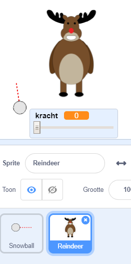
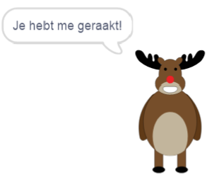
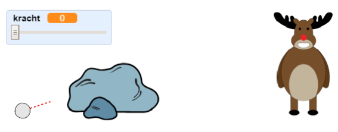
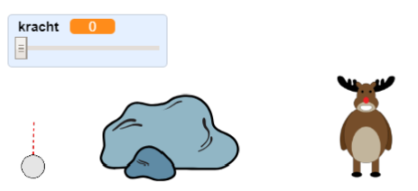

## Het doelwit

Laten we een doelwit voor je sneeuwballen toevoegen!

--- task ---

Voeg nog een sprite toe aan je project.



[[[generic-scratch3-sprite-from-library]]]

--- /task ---

--- task ---

Voeg deze code toe aan je nieuwe sprite, zodat er staat: "Je hebt me geraakt!" wanneer het wordt geraakt:


```blocks3
when flag clicked
forever
	if < touching [snowball v]? > then
		say [Je hebt me geraakt!] for (1) seconds
	end
end
```

--- /task ---

--- task ---

Test je nieuwe code.



--- /task ---

--- task ---

Laten we een paar dingen doen om het spel moeilijker te maken. Laten we eerst het rendier verplaatsen telkens wanneer de speler de sneeuwbal gooit.

Voeg hiervoor eerst een `bericht`{:class="block3control"} toe aan je sneeuwbal, bovenin je `herhaal`{:class="block3control"} lus. Zo weet je rendier dat er een nieuwe sneeuwbal aankomt.


```blocks3
when green flag clicked
herhaal
maak [kracht v] (0)
+ zend signaal (nieuwe worp v)
wacht (0.5) sec.
ga naar x:(-200) y:(-130)
richt naar (90) graden
verander uiterlijk naar (snowball-aim v)
verschijn
herhaal tot <muis ingedrukt?>
    richt naar (muisaanwijzer v)
einde
herhaal tot < niet <muis ingedrukt?> >
    richt naar (muisaanwijzer v)
    verander [kracht v] met (1)
    wait (0.1) seconds
einde
zend signaal (gooi v) en wacht
einde
```

Wanneer het rendier dit bericht ontvangt, verplaats je het naar een nieuwe willekeurige positie met deze code:


```blocks3
wanneer ik signaal [nieuwe worp v] ontvang
maak x (willekeurig getal tussen (0) en (200))
```

--- /task ---

--- task ---

Test je project door een paar sneeuwballen te gooien. Verplaatst je doelwit elke keer van positie?

--- /task ---

--- task ---

Je kunt je spel ook moeilijker maken door een steen voor je sneeuwbal toe te voegen.



--- /task ---

--- task ---

Je kunt nu je sneeuwbalcode wijzigen om te stoppen wanneer deze de rand van het scherm raakt _of_ wanneer deze de rots raakt.


```blocks3
wanneer ik signaal [gooi v] ontvang
verander uiterlijk naar (snowball v)
+ herhaal tot << raak ik [rand v]? > of <raak ik [Rocks v]?>>
    verander y met (-5)
    neem (kracht) stappen
    als <(kracht) > [0]> dan
    verander [kracht v] met (-0.25)
    einde
einde
verdwijn
```

--- /task ---

--- task ---

Tenslotte kun je je spel moeilijker maken door je sneeuwbal en je rendieren kleiner te maken.



--- /task ---
