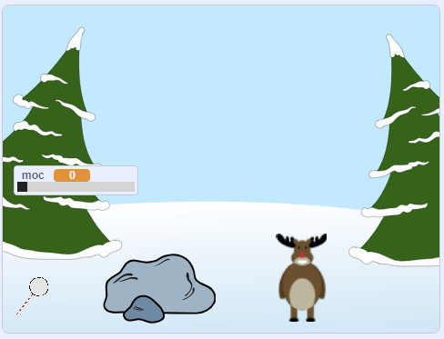

--- no-print ---

To jest **Scratch 3** wersja projektu. Istnieje również [wersja tego projektu dla Scratch 2](https://projects.raspberrypi.org/en/projects/snowball-fight-scratch2).

--- /no-print ---

## Wprowadzenie

W tym projekcie stworzysz grę, w której będziesz rzucać śnieżkami w cel.

### Co stworzysz

--- no-print ---

Użyj kursora myszy, aby ustawić kąt śnieżki i przytrzymaj przycisk myszy, aby wybrać moc kuli śnieżnej.

  <iframe allowtransparency="true" width="485" height="402" src="https://scratch.mit.edu/projects/embed/302159331/?autostart=true" frameborder="0" scrolling="no"></iframe>
  

--- /no-print ---

--- print-only ---

--- /print-only ---

--- collapse ---
---
title: Czego będziesz potrzebować
---

### Sprzęt

+ Komputer, na którym można uruchomić Scratch

### Oprogramowanie

+ Scratch 3 ([online](https://rpf.io/scratchon) {:target="_blank"} lub [offline](https://rpf.io/scratchoff) {:target="_blank"})

### Pliki do pobrania

Projekt początkowy można znaleźć [tutaj](https://rpf.io/p/en/snowball-fight-go){:target="_blank"}.

--- /collapse ---

--- collapse ---
---
title: Czego się nauczysz
---

- Jak animować ikony
- Jak reagować na kliknięcia myszą
- jak korzystać z transmisji

--- /collapse ---

--- collapse ---
---
title: Dodatkowe informacje dla nauczycieli
---

--- no-print ---

Jeśli chcesz wydrukować ten projekt, użyj [wersji do druku](https://projects.raspberrypi.org/en/projects/snowball-fight/print){:target="_blank"}.

--- /no-print ---

Możesz znaleźć [ukończoną wersję projektu tutaj](https://rpf.io/p/en/snowball-fight-get){:target="_blank"}.

--- /collapse ---
