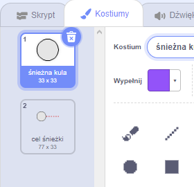
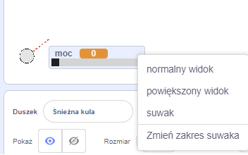
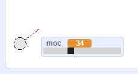

## Lepienie śnieżek

Zróbmy śnieżną kulę, którą możesz rzucać po całej scenie.

--- task ---

Otwórz projekt startowy Scratch.

**Online**: otwórz [projekt początkowy](https://rpf.io/snowball-fight-on){:target ="_ blank"}.

Jeśli masz konto Scratch, możesz wykonać kopię klikając **Remiks**.

**Offline**: otwórz [startowy projekt](https://rpf.io/p/en/snowball-fight-go){:target="_ blank"} w edytorze offline.

Jeśli musisz pobrać i zainstalować edytor Scratcha, znajdziesz go na stronie [rpf.io/scratchoff](https://rpf.io/scratchoff){:target="_blank"}.

W projekcie startowym powinno być widoczne puste tło i ikona "śnieżka".

--- /task ---

--- task ---

Ikona "Śnieżka" zawiera 2 kostiumy, normalny kostium i taki, który pokazuje kierunek, w który skierowana jest śnieżka.



--- /task ---

--- task ---

Po pierwsze, pozwólmy graczowi zmienić kąt śnieżki. Dodaj ten kod do ikon ze śnieżkami:


```blocks3
when flag clicked
wait (0.5) seconds
go to x:(-200) y:(-130)
point in direction (90)
switch costume to (snowball-aim v)
repeat until <mouse down?>
    point towards (mouse-pointer v)
end
```

--- /task ---

--- task ---

Przetestuj swój projekt, klikając zieloną flagę. Zobacz, że śnieżka podąża za myszą, dopóki nie naciśniesz przycisku myszy.


--- /task ---

--- task ---

Pozwólmy również graczowi zdecydować o tym, jak potężna powinna być rzucona śnieżka. Utwórz nową zmienną o nazwie `moc`{:class="block3variables"}.

[[[generic-scratch3-add-variable]]]

--- /task ---

--- task ---

Przeciągnij twój nowy wyświetlacz zmiennych na dół sceny, w pobliżu śnieżki. Kliknij prawym przyciskiem myszy na ekranie zmiennej i kliknij przycisk 'suwak'.



--- /task ---

--- task ---

Dodaj kod, aby ustawić nową zmienną `moc`{:class="block3variables"} na 0 po kliknięciu flagi.


```blocks3
when flag clicked
+ set [power v] to (0)
```

--- /task ---

--- task ---

Teraz, gdy masz zmienną `moc`{:class="block3variables"}, możesz później zwiększyć moc śnieżki _po_ wybraniu kierunku za pomocą tego kodu:


```blocks3
repeat until <mouse down?>
    point towards (mouse-pointer v)
end
+repeat until < not <mouse down?> >
    point towards (mouse-pointer v)
    change [power v] by (1)
    wait (0.1) seconds
end
```

Ten kod oznacza, że musisz _przytrzymać przycisk myszy _ po wybraniu kierunku, aby wybrać siłę śnieżki.

--- /task ---

--- task ---

Przetestuj swoją śnieżkę, aby zobaczyć, czy możesz wybrać jej kąt i moc.



--- /task ---
