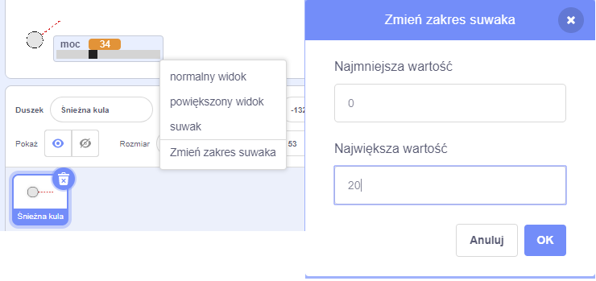

## Realistyczny ruch

Masz teraz śnieżkę, ale sprawmy, aby poruszała się bardziej realistycznie.

--- task ---

Najpierw ustawmy maksymalny poziom mocy, aby śnieżka nie mogła być rzucana zbyt mocno.

W kodzie twojej śnieżnej kuli `kiedy kliknięnto flagę`{:class="block3events"}, musimy zwiększyć moc tylko wtedy, gdy jest mniejsza niż 20. Zmień kod na:


```blocks3
repeat until< not <mouse down?> >
+   if < (power) < [20] > then
        change [power v] by (1)
        wait (0.1) seconds
    end
end
```

--- /task ---

--- task ---

Ponownie przetestuj swoją śnieżkę, a zobaczysz, że moc nigdy nie osiągnie wartości powyżej 20.

--- /task ---

--- task ---

Teraz, gdy maksymalna moc twojej śnieżki wynosi 20, możesz ustawić tę wartość jako maksymalną wartość suwaka zmiennej. Kliknij prawym przyciskiem myszy na zmienną mocy i kliknij 'ustaw suwak min. i maks'.




--- /task ---

--- task ---

Możesz także spowolnić śnieżkę, zmniejszając nieco moc, gdy leci w powietrzu. Dodaj ten blok kodu do śnieżki `kiedy otrzymam [rzucać]`{:class="block3events"}:


```blocks3
when I receive [throw v]
switch costume to (snowball v)
repeat until < touching [edge v]? >
    move (power) steps
+   change [power v] by (-0.25)
end
hide
```

--- /task ---


--- task ---

Przetestuj ten nowy kod - czy działa zgodnie z oczekiwaniami? Możesz zauważyć, że moc zmniejsza się, i ostatecznie śnieżka porusza się do tyłu!

Aby to naprawić, możesz dodać blok `jeżeli`{:class="block3control"} do twojego kodu, aby moc była obniżona tylko wtedy, gdy jest powyżej 0:


```blocks3
when I receive [throw v]
switch costume to (snowball v)
repeat until < touching [edge v]? >
    move (power) steps
+   if < (power) > (0) > then
        change [power v] by (-0.25)
    end
end
hide
```

--- /task ---

--- task ---

Już prawie gotowe, ale musisz także dodać trochę grawitacji do śnieżki, aby spadła na ziemię. Możesz dodać grawitację, po prostu przesuwając śnieżkę w dół za pomocą tego kodu:


```blocks3
when I receive [throw v]
switch costume to (snowball v)
repeat until < touching [edge v]? >
+   change y by (-5)
    move (power) steps
    if < (power) > (0) > then
        change [power v] by (-0.25)
    end
end
hide
```

--- /task ---

--- task ---

Ponownie przetestuj śnieżkę i zauważysz, że śnieżka porusza się o wiele bardziej realistycznie.

--- /task ---

