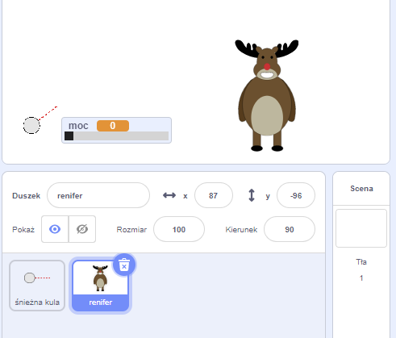
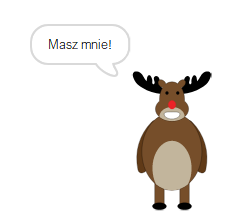
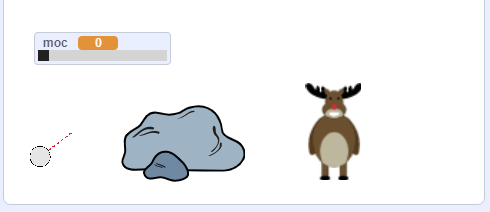
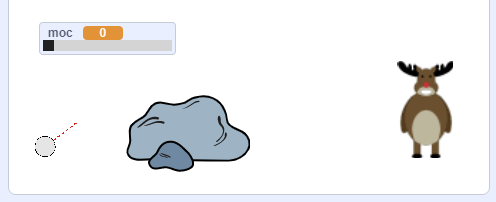

## Cel

Dodajmy cel dla twoich śnieżek!

--- task ---

Dodaj inną ikonę do projektu.



[[[generic-scratch3-sprite-from-library]]]

--- /task ---

--- task ---

Dodaj ten kod do nowej ikony/duszka, tak, aby mówił: „Masz mnie!”, kiedy zostanie trafiony:


```blocks3
when flag clicked
forever
    if < touching [śnieżka v]? > then
        say [Masz mnie!] for (1) seconds
    end
end
```

--- /task ---

--- task ---

Przetestuj swój nowy kod.



--- /task ---

--- task ---

Zróbmy kilka rzeczy, aby gra była trudniejsza. Najpierw poruszajmy reniferami za każdym razem, gdy gracz rzuca śnieżką.

Aby to zrobić, najpierw dodaj `komunikat`{:class="block3control"} na śnieżkę, obok górnej części pętli `zawsze`{:class="block3control"}. Dzięki temu Twój renifer będzie wiedział, że wkrótce zostanie wystrzelony nowy strzał.


```blocks3
when flag clicked
forever
set [moc v] to (0)
+broadcast (nowy strzał v)
wait (0.5) seconds
go to x:(-200) y:(-130)
point in direction (90)
switch costume to (cel śnieżki v)
show
repeat until <mouse down?>
    point towards (wskaźnik myszy v)
end
repeat until < not <mouse down?> >
    point towards (wskaźnik myszy v)
    change [moc v] by (1)
    wait (0.1) seconds
end
broadcast (rzucać v) and wait
end
```

Gdy renifer otrzyma tę wiadomość, przenieś ją na nową losową pozycję za pomocą tego kodu:


```blocks3
when I receive [nowy strzał v]
set x to (pick random (0) to (200))
```

--- /task ---

--- task ---

Przetestuj swój projekt, rzucając kilka śnieżek. Czy Twój cel zmienia pozycję za każdym razem?

--- /task ---

--- task ---

Możesz również utrudnić swoją grę dodając kamień przed swoją śnieżką.



--- /task ---

--- task ---

Możesz teraz zmienić swój kod śnieżki, aby zatrzymać się, gdy dotknie krawędzi ekranu _lub_ gdy dotknie skały.


```blocks3
when I receive [rzucać v]
switch costume to (śnieżka v)
+ repeat until << touching [krawędź v]? > or <touching [Rocks v]?>>
    change y by (-5)
    move (moc) steps
    if <(moc) > [0]> then
    change [moc v] by (-0.25)
    end
end
hide
```

--- /task ---

--- task ---

Wreszcie, możesz utrudnić grę, zmniejszając swoją śnieżkę i renifera.



--- /task ---
