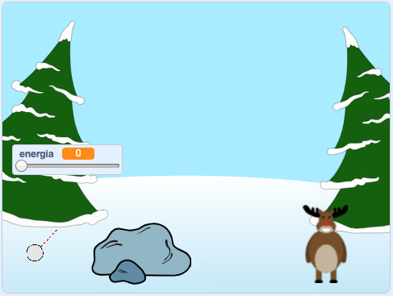

--- no-print ---

Esta é a versão **Scratch 3** do projeto. Há também uma [versão Scratch 2 do projeto](https://projects.raspberrypi.org/pt-BR/projects/snowball-fight-scratch2).

--- /no-print ---

## Introdução

Neste projeto você vai fazer um jogo em que você tem que atirar bolas de neve em um alvo.

### O que você vai fazer

--- no-print ---

Use o ponteiro do mouse para inclinar a bola de neve e mantenha pressionado o botão do mouse para escolher a energia da bola de neve.

  <iframe allowtransparency="true" width="485" height="402" src="https://scratch.mit.edu/projects/embed/883744893/?autostart=true" frameborder="0" scrolling="no"></iframe>
  

--- /no-print ---

--- print-only ---

--- /print-only ---

--- collapse ---
---
title: O que você vai precisar
---

### Hardware

+ Um computador capaz de executar o Scratch

### Software

+ Scratch 3 ([online](https://rpf.io/scratchon){:target="_blank"} ou [offline](https://rpf.io/scratchoff){:target="_blank"})

### Downloads

O projeto inicial pode ser encontrado [aqui](https://rpf.io/p/pt-BR/snowball-fight-go){:target="_blank"}.

--- /collapse ---

--- collapse ---
---
title: O que você vai aprender
---

- Como animar atores
- Como reagir aos movimentos do mouse
- como usar as transmissões de mensagens

--- /collapse ---

--- collapse ---
---
title: informações adicionais para educadores
---

--- no-print ---

Se você precisar imprimir este projeto, por favor, use a [versão para impressão](https://projects.raspberrypi.org/pt-BR/projects/snowball-fight/print){:target="_blank"}.

--- /no-print ---

Você pode encontrar o [projeto concluído aqui](https://rpf.io/p/pt-BR/snowball-fight-get){:target="_blank"}.

--- /collapse ---
