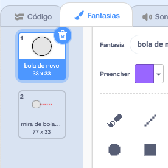
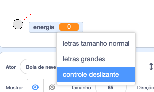
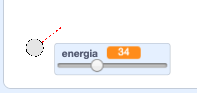

## Fazendo uma bola de neve

Vamos fazer uma bola de neve que você pode atirar ao redor de seu palco.

--- task ---

Abra o projeto inicial do Scratch.

**Online**: open the [starter project](https://rpf.io/snowball-fight-on){:target="_blank"}.

Se você tiver uma conta do Scratch, você pode fazer uma cópia clicando em **Remix**.

**Offline**: open the [starter project](https://rpf.io/p/en/snowball-fight-go){:target="_blank"} in the offline editor.

If you need to download and install the Scratch offline editor, you can find it at [rpf.io/scratchoff](https://rpf.io/scratchoff){:target="_blank"}.

No projeto inicial, você deve ver um palco em branco e um ator bola de neve.

--- /task ---

--- task ---

O ator 'Bola de neve' contém 2 fantasias, uma fantasia normal e uma que mostra em qual direção a bola de neve está apontada.



--- /task ---

--- task ---

Primeiro, vamos permitir que o jogador mude o ângulo da bola de neve. Adicione este código ao seu ator bola de neve:


```blocks3
when flag clicked
wait (0.5) seconds
go to x:(-200) y:(-130)
point in direction (90)
switch costume to (snowball-aim v)
repeat until <mouse down?>
    point towards (mouse-pointer v)
end
```

--- /task ---

--- task ---

Teste seu projeto clicando na bandeira verde. Você deve ver que sua bola de neve segue o mouse até você pressionar o botão do mouse.


--- /task ---

--- task ---

Vamos também permitir que o jogador decida com qual força a bola de neve deve ser atirada. Crie uma nova variável chamada `energia`{:class="block3variables"}.

[[[generic-scratch3-add-variable]]]

--- /task ---

--- task ---

Arraste sua nova variável para a parte inferior do palco, perto da bola de neve. Clique com o botão direito do mouse na exibição da variável e clique em 'controle deslizante'.



--- /task ---

--- task ---

Adicione código para definir sua nova variável `energia`{:class="block3variables"} como 0 quando a bandeira for clicada.


```blocks3
when flag clicked
+ set [power v] to (0)
```

--- /task ---

--- task ---

Agora que você tem uma variável `energia`{:class="block3variables"}, você pode aumentar a força com que a bola de neve é atirada _depois_ que a direção foi escolhida com este código:


```blocks3
repeat until <mouse down?>
    point towards (mouse-pointer v)
end
+repeat until < not <mouse down?> >
    point towards (mouse-pointer v)
    change [power v] by (1)
    wait (0.1) seconds
end
```

Este código significa que você tem que _manter o botão do mouse pressionado_ depois de escolher a direção, para escolher a força com que a bola de neve será atirada.

--- /task ---

--- task ---

Teste sua bola de neve para ver se você pode escolher seu ângulo e força.



--- /task ---
