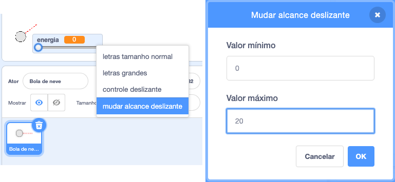

## Movimento realista

Você agora tem uma bola de neve, mas vamos fazer com que ela se mova de maneira mais realista.

--- task ---

Primeiro, vamos definir um nível máximo de energia, para que a bola de neve não possa ser atirada com muita força.

No código da sua bola de neve `quando ⚑ for clicado`{:class="block3events"}, precisamos aumentar a energia somente se for menor que 20. Mude seu código para:


```blocks3
repeat until< not <mouse down?> >
+   if < (power) < [20] > then
        change [power v] by (1)
        wait (0.1) seconds
    end
end
```

--- /task ---

--- task ---

Teste sua bola de neve novamente e você verá que a energia nunca fica acima de 20.

--- /task ---

--- task ---

Agora que a energia máxima da sua bola de neve é 20, você também pode definir isso como o valor máximo para o controle deslizante da variável. Clique com o botão direito sobre sua variável energia e clique em 'mudar alcance deslizante'.




--- /task ---

--- task ---

Você também pode diminuir a velocidade da bola de neve, reduzindo a energia levemente enquanto ela voa pelo ar. Adicione este bloco de código ao código da sua bola de neve `quando eu receber [throw]`{:class="block3events"}:


```blocks3
when I receive [throw v]
switch costume to (snowball v)
repeat until < touching [edge v]? >
    move (power) steps
+   change [power v] by (-0.25)
end
hide
```

--- /task ---


--- task ---

Teste este novo código - ele funciona como você esperava? Você pode notar que a energia continua diminuindo, e chega um momento que a bola de neve se move para trás!

Para corrigir isso, você pode adicionar um bloco `se`{:class="block3control"} ao seu código, para que a energia só seja reduzida se ela estiver acima de 0:


```blocks3
when I receive [throw v]
switch costume to (snowball v)
repeat until < touching [edge v]? >
    move (power) steps
+   if < (power) > (0) > then
        change [power v] by (-0.25)
    end
end
hide
```

--- /task ---

--- task ---

Você está quase lá, mas também precisa adicionar um pouco de gravidade à sua bola de neve para que ela caia no chão. Você pode adicionar gravidade apenas movendo a bola de neve continuamente para baixo com este código:


```blocks3
when I receive [throw v]
switch costume to (snowball v)
repeat until < touching [edge v]? >
+   change y by (-5)
    move (power) steps
    if < (power) > (0) > then
        change [power v] by (-0.25)
    end
end
hide
```

--- /task ---

--- task ---

Teste sua bola de neve novamente e você verá que ela se move muito mais realisticamente.

--- /task ---

