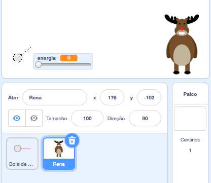
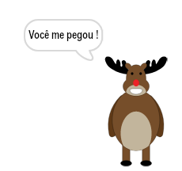
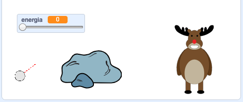
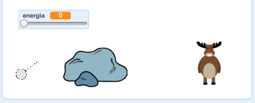

## O alvo

Vamos adicionar um alvo para suas bolas de neve!

--- task ---

Adicione outro ator ao seu projeto.



[[[generic-scratch3-sprite-from-library]]]

--- /task ---

--- task ---

Adicione este código ao seu novo ator, para que ele diga "Você me pegou!" quando é atingido:


```blocks3
when flag clicked
forever
    if < touching [bola de neve v]? > then
        say [Você me pegou!] for (1) seconds
    end
end
```

--- /task ---

--- task ---

Teste o seu novo código.



--- /task ---

--- task ---

Vamos fazer algumas coisas para tornar o jogo mais difícil. Primeiro, vamos mover a rena cada vez que o jogador atirar a bola de neve.

Para fazer isso, primeiro adicione `transmita`{:class="block3control"} à sua bola de neve, perto do topo do seu laço `sempre`{:class="block3control"}. Isto permitirá que sua rena saiba que uma nova bola de neve está prestes a ser atirada.


```blocks3
when flag clicked
forever
set [energia v] to (0)
+broadcast (novo tiro v)
wait (0.5) seconds
go to x:(-200) y:(-130)
point in direction (90)
switch costume to (mira da bola de neve v)
show
repeat until <mouse down?>
    point towards (mouse-pointer v)
end
repeat until < not <mouse down?> >
    point towards (mouse-pointer v)
    change [energia v] by (1)
    wait (0.1) seconds
end
broadcast (atirar v) and wait
end
```

Quando sua rena receber essa mensagem, mova-a para uma nova posição aleatória com este código:


```blocks3
when I receive [novo tiro v]
set x to (pick random (0) to (200))
```

--- /task ---

--- task ---

Teste seu projeto atirando algumas bolas de neve. O seu alvo se move a cada vez?

--- /task ---

--- task ---

Você também pode dificultar o jogo adicionando uma pedra na frente da sua bola de neve.



--- /task ---

--- task ---

Agora você pode alterar seu código da bola de neve, para parar quando tocar na borda da tela _ou_ quando tocar a pedra.


```blocks3
when I receive [atirar v]
switch costume to (bola de neve v)
+ repeat until << touching [edge v]? > or <touching [Rocks v]?>>
    change y by (-5)
    move (energia) steps
    if <(energia) > [0]> then
    change [energia v] by (-0.25)
    end
end
hide
```

--- /task ---

--- task ---

Finalmente, você pode tornar seu jogo mais difícil deixando sua bola de neve e sua rena menores.



--- /task ---
