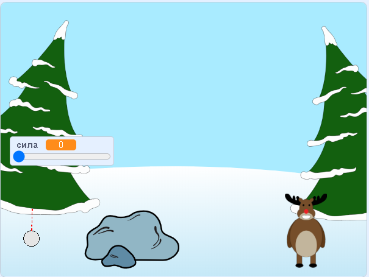

--- no-print ---

Это версия проекта для **Scratch 3**. Есть также [версия проекта для Scratch 2](https://projects.raspberrypi.org/en/projects/snowball-fight-scratch2).

--- /no-print ---

## Введение

В этом проекте ты создашь игру, в которой необходимо бросать снежки в цель.

### Что ты сделаешь

--- no-print ---

Используй указатель мыши, чтобы выбрать угол полёта снежка, и удерживай кнопку мыши, чтобы выбрать, с какой силой его запустить.

  <iframe allowtransparency="true" width="485" height="402" src="https://scratch.mit.edu/projects/embed/302159331/?autostart=true" frameborder="0" scrolling="no"></iframe>
  

--- /no-print ---

--- print-only ---

--- /print-only ---

--- collapse ---
---
title: Что тебе понадобится
---

### Оборудование

+ Компьютер, способный запускать Scratch

### Программное обеспечение

+ Scratch 3 (either [online](https://rpf.io/scratchon){:target="_blank"} or [offline](https://rpf.io/scratchoff){:target="_blank"})

### Загрузки

The starter project can be found [here](https://rpf.io/p/en/snowball-fight-go){:target="_blank"}.

--- /collapse ---

--- collapse ---
---
title: Чему ты научишься
---

- Как анимировать спрайты
- Как обрабатывать ввод мышью
- как использовать передачу информации

--- /collapse ---

--- collapse ---
---
title: Дополнительная информация для преподавателей
---

--- no-print ---

Если Вы хотите распечатать этот проект, то воспользуйтесь [версией для печати](https://projects.raspberrypi.org/en/projects/snowball-fight/print){:target="_blank"}.

--- /no-print ---

You can find the [completed project here](https://rpf.io/p/en/snowball-fight-get){:target="_blank"}.

--- /collapse ---
